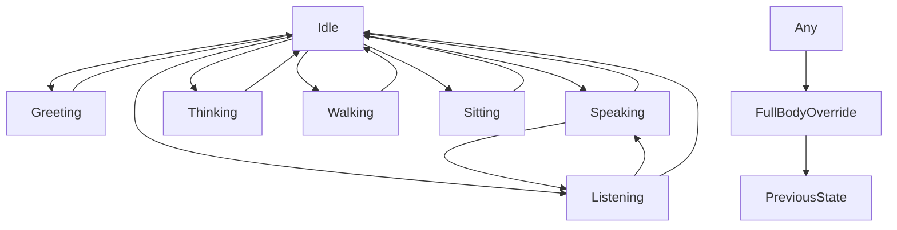

# Animation Production Bible

## Enterprise 3D Animation Production Documentation

| Metadata | |
|---|---|
| **Document ID** | VP-ANIM-001 |
| **Version** | 1.0 |
| **Status** | Final |
| **Classification** | Enterprise Animation Production Specification |
| **Last Updated** | 2026-07-10 |
| **Department** | Visual Production — Animation Division |
| **Technical Lead** | Animation Director / Lead Technical Animator |

### Cross-Reference Links

| Document | Location |
|---|---|
| Visual Asset Audit | [00_Visual_Asset_Audit.md](../00_Visual_Asset_Audit/00_Visual_Asset_Audit.md) |
| Visual Production Bible | [01_Visual_Production_Bible.md](../01_Visual_Production_Bible/01_Visual_Production_Bible.md) |
| 3D Asset Bible | [03_3D_Asset_Bible.md](../03_3D_Asset_Bible/03_3D_Asset_Bible.md) |
| Motion Design Bible | [../../UX_Design/06_Motion_Design_Bible/06_Motion_Design_Bible.md](../../UX_Design/06_Motion_Design_Bible/06_Motion_Design_Bible.md) |
| Video Production Bible | [05_Video_Production_Bible.md](../05_Video_Production_Bible/05_Video_Production_Bible.md) |
| Audio Production Bible | [06_Audio_Production_Bible.md](../06_Audio_Production_Bible/06_Audio_Production_Bible.md) |
| Asset Pipeline | [07_Asset_Pipeline.md](../07_Asset_Pipeline/07_Asset_Pipeline.md) |
| Quality Control | [08_Quality_Control.md](../08_Quality_Control/08_Quality_Control.md) |
| AI Asset Generation | [09_AI_Asset_Generation.md](../09_AI_Asset_Generation/09_AI_Asset_Generation.md) |

---

## Table of Contents

1. [Animation Production Philosophy](#1-animation-production-philosophy)
2. [Production Pipeline & Workflow](#2-production-pipeline--workflow)
3. [Rigging Specifications](#3-rigging-specifications)
4. [Avatar Animation Production](#4-avatar-animation-production)
5. [Knowledge Spirit Animation Production](#5-knowledge-spirit-animation-production)
6. [Knowledge Tree Growth Animation Production](#6-knowledge-tree-growth-animation-production)
7. [Memory Pulse Animation Production](#7-memory-pulse-animation-production)
8. [Story Scene Transition Animation Production](#8-story-scene-transition-animation-production)
9. [Documentary Transition Animation Production](#9-documentary-transition-animation-production)
10. [AI Thinking Animation Production](#10-ai-thinking-animation-production)
11. [Loading Animation Production](#11-loading-animation-production)
12. [Reward Animation Production](#12-reward-animation-production)
13. [Achievement Animation Production](#13-achievement-animation-production)
14. [Scene Transition Animation Production (3D Environments)](#14-scene-transition-animation-production-3d-environments)
15. [Environmental Animation Production](#15-environmental-animation-production)
16. [Particle Effects Production System](#16-particle-effects-production-system)
17. [Glow Effects Production System](#17-glow-effects-production-system)
18. [Micro Animation Production (3D)](#18-micro-animation-production-3d)
19. [Facial Animation & Lip Sync Production](#19-facial-animation--lip-sync-production)
20. [Animation Blending & State Machine](#20-animation-blending--state-machine)
21. [Animation Retargeting System](#21-animation-retargeting-system)
22. [Animation Data & File Specifications](#22-animation-data--file-specifications)
23. [Animation LOD System](#23-animation-lod-system)
24. [Performance Budget & Optimization](#24-performance-budget--optimization)
25. [Quality Control & Review Process](#25-quality-control--review-process)
26. [Appendix A: Animation Naming Conventions](#26-appendix-a-animation-naming-conventions)
27. [Appendix B: Production Checklist Templates](#27-appendix-b-production-checklist-templates)
28. [Appendix C: Animation Curve Reference](#28-appendix-c-animation-curve-reference)
29. [Appendix D: Software & Tool Specifications](#29-appendix-d-software--tool-specifications)

---

## 1. Animation Production Philosophy

### 1.1 Core Tenets of the Animation Production System

Animation within this platform is a vehicle for learning, emotional connection, and knowledge visualization. Every frame produced must serve the platform's educational mission. Animation production is not decorative — it is communicative. The animation department operates under a set of foundational principles that govern every keyframe, every curve, and every transition produced.

**Learning-First Motion:** Every animation produced must answer one question: does this motion help the user learn? Avatar gestures direct attention to content. Knowledge spirit movement guides the eye to important information. Environmental animation creates an atmosphere conducive to focus and retention. Any animation that does not serve learning or emotional connection is eliminated from production.

**Emotional Resonance Through Motion:** Characters feel alive through subtle, secondary motion. A character that stands perfectly still feels dead. A character that moves with constant, mechanical precision feels robotic. The production standard requires that every character animation include at minimum three layers of motion: primary action (the main movement), secondary action (follow-through and overlap), and micro-motion (breathing, weight shift, micro-gestures). These layers combine to create the illusion of a living, thinking being.

**Pixar-Inspired Quality Standards:** The animation quality benchmark is Pixar feature film quality, adapted for real-time performance. This means:

- **Weight:** Every movement must convey mass. A heavy object (or character carrying weight) moves with slower acceleration and deceleration. A light object moves with faster, more responsive motion. Weight is communicated through timing, spacing, and the arc of movement.
- **Timing:** Animation timing must feel intentional. Fast movements communicate energy, urgency, or surprise. Slow movements communicate weight, deliberation, or sadness. Timing must be varied — never constant velocity or uniform rhythm across all animations.
- **Appeal:** Every pose must be visually pleasing. Silhouette is paramount — every key pose must read clearly in silhouette. Line of action must flow through the character. Symmetry is avoided; opposing angles and broken joints create natural, appealing poses.

**Subtlety as a Production Value:** The most sophisticated animation is often the most subtle. Characters in the platform do not perform for the camera — they exist in a learning environment. Their motion must be believable and restrained. Over-acting is a production error. The animation director reviews all character animation for appropriate subtlety relative to the learning context.

**Cultural Authenticity in Motion:** Animations must respect the cultural context of the platform. Greeting animations use the appropriate cultural gestures (salaam, nod). Teaching animations reference traditional teaching poses (pointing, gesturing to a board). Walking animations respect modest movement. The animation production team must reference cultural motion studies before producing character animations.

### 1.2 Animation Production Hierarchy

The animation production system is organized into five tiers of motion complexity, each with its own production workflow, review process, and quality standard.

**Tier 1 — Core Loop Animations:** The most frequently viewed animations. These include idle breathing, UI response, avatar blink cycles, and knowledge tree daily growth. These animations must be produced to the highest quality standard as they are seen thousands of times per user session. Production time allocation: 40% of animation budget.

**Tier 2 — Interactive Animations:** Animations triggered by user action. Greetings, farewells, teaching gestures, knowledge spirit reactions, card interactions. These animations must be responsive (fast blend-in from any state) and must support interruption. Production time allocation: 25% of animation budget.

**Tier 3 — Narrative Animations:** Animations that tell a story or convey information over time. Story scene transitions, documentary transitions, growth sequences, achievement sequences. These animations can be longer and more elaborate but must support skipping. Production time allocation: 20% of animation budget.

**Tier 4 — Ambient Animations:** Environmental and atmospheric animations. Water, fire, wind, clouds, stars, leaves, weather. These animations loop continuously and must be optimized for performance. Production time allocation: 10% of animation budget.

**Tier 5 — Micro Animations:** The smallest motion in the system. Button press, card lift, accessory sway, blink. These animations are produced as reusable animation clips and are referenced across the platform. Production time allocation: 5% of animation budget.

### 1.3 Production Time Estimates

| Animation Type | Production Time (per animator) | Review Cycles | Total Production Hours |
|---|---|---|---|
| Idle animation (full body, 3 variants) | 8 hours | 3 | 24 hours |
| Greeting animation | 4 hours | 2 | 8 hours |
| Teaching gesture (single) | 3 hours | 2 | 6 hours |
| Full body walk cycle | 16 hours | 3 | 48 hours |
| Lip sync (per 30s dialogue) | 6 hours | 2 | 12 hours |
| Knowledge tree growth (full sequence) | 40 hours | 4 | 160 hours |
| Memory pulse animation | 4 hours | 2 | 8 hours |
| Particle system (single effect) | 3 hours | 2 | 6 hours |
| Environmental loop (water, fire) | 8 hours | 2 | 16 hours |
| Loading animation (full sequence) | 16 hours | 3 | 48 hours |
| Achievement unlock sequence | 12 hours | 3 | 36 hours |
| Scene transition (3D) | 8 hours | 2 | 16 hours |
| Rigging character (full body) | 40 hours | 3 | 120 hours |
| Blend shape creation (per character) | 16 hours | 2 | 32 hours |
| Animation retargeting setup (per body type) | 8 hours | 1 | 8 hours |

---

## 2. Production Pipeline & Workflow

### 2.1 Animation Production Pipeline Overview

The animation production pipeline consists of seven discrete stages, each with defined inputs, outputs, quality gates, and responsible roles. Every animation asset must pass through all seven stages before being considered production-ready.

**Stage 1 — Pre-Production & Planning:**
- Input: Storyboard, animatic, design reference, character model sheets
- Activities: Animation breakdown, timing chart, pose script, reference video capture
- Output: Animatic with timing, pose script document, reference video library
- Responsible: Animation Director, Senior Animator
- Quality Gate: Director approves animatic timing and pose script

**Stage 2 — Blocking (Layout):**
- Input: Approved animatic, character rigs, environment layouts
- Activities: Key pose placement at extreme frames, rough timing, camera layout
- Output: Blocked animation file with stepped tangents, camera layout
- Responsible: Animator
- Quality Gate: Supervisor reviews silhouettes and storytelling clarity

**Stage 3 — Splining (In-Betweens):**
- Input: Blocked animation with key poses
- Activities: Convert stepped keys to spline curves, refine timing, add breakdown poses
- Output: Splined animation with continuous curves, no stepped tangents
- Responsible: Animator
- Quality Gate: Animation passes without gimbal lock, foot slippage, or penetration

**Stage 4 — Polish (Layered Refinement):**
- Input: Splined animation with continuous curves
- Activities: Add overlapping action, follow-through, secondary motion, micro-adjustments
- Output: Polished animation with all motion layers
- Responsible: Senior Animator
- Quality Gate: Director review for appeal and weight

**Stage 5 — Technical Validation:**
- Input: Polished animation file
- Activities: IK/FK validation, foot lock verification, collision check, compression test
- Output: Validated animation with technical pass certificate
- Responsible: Technical Animator
- Quality Gate: No technical errors, passes automated checks

**Stage 6 — Export & Integration:**
- Input: Validated animation, rig, skin weights
- Activities: Bake animations, compress curves, export to runtime format, import to engine
- Output: Runtime animation file (FBX, glTF, format-specific), animation blueprint
- Responsible: Technical Animator, Pipeline TD
- Quality Gate: Integration test passes in-engine

**Stage 7 — Final Review & Sign-Off:**
- Input: In-engine animation playing in context
- Activities: Side-by-side comparison with reference, performance profiling, regression testing
- Output: Signed-off animation asset in production database
- Responsible: Animation Director, QA
- Quality Gate: Artistic approval + technical approval + performance approval

### 2.2 Software Pipeline Specifications

| Production Stage | Primary Software | Secondary Software | File Format |
|---|---|---|---|
| Pre-Production | Storyboard Pro, Premiere Pro | After Effects | .sbpro, .mov, .aep |
| Blocking | Maya, Blender | MotionBuilder | .ma, .mb, .blend |
| Splining | Maya, Blender | — | .ma, .mb, .blend |
| Polish | Maya, Blender | MotionBuilder | .ma, .mb, .blend |
| Technical Validation | Maya, Python scripts | MotionBuilder | .ma, .fbx |
| Export & Integration | Maya, Unity/Unreal | Python, C# | .fbx, .glb, .anim |
| Final Review | Unity/Unreal Engine | — | Engine project |

### 2.3 Animation Data Management

All animation data is managed through the central asset database with version control. Each animation asset has a unique identifier, version history, and dependency tracking.

**Animation Asset Record Schema:**
```
AssetID: ANIM_[Category]_[Subcategory]_[Number]
  Example: ANIM_AVATAR_IDLE_001
Category: AVATAR | SPIRIT | TREE | MEMORY | STORY | DOC | AI | LOADING | REWARD | ACHIEVEMENT | SCENE | ENVIRONMENT | PARTICLE | GLOW | MICRO
Version: MAJOR.MINOR.PATCH (e.g., 1.2.3)
  MAJOR: Breaking change to animation timing or content
  MINOR: Non-breaking addition or refinement
  PATCH: Technical fix, compression adjustment, export correction
Status: BLOCKING | SPLINING | POLISH | TECHNICAL_VALIDATION | EXPORTED | APPROVED | DEPRECATED
Dependencies: [Rig asset IDs, Blend shape asset IDs, Environment asset IDs]
Created: YYYY-MM-DD
LastModified: YYYY-MM-DD
ModifiedBy: [Animator ID]
ApprovedBy: [Director ID]
```

**Animation File Naming Convention:**
```
[Category]_[Subcategory]_[AssetNumber]_[Variant]_[Version].extension
Example: AVATAR_GREET_001_WAVE_v1.2.ma
Example: SPIRIT_FLOAT_001_IDLE_v2.0.fbx
Example: TREE_GROWTH_003_FLOURISH_v1.1.anim
```

### 2.4 Animation Production Team Roles & Responsibilities

| Role | Responsibilities | Required Skills |
|---|---|---|
| Animation Director | Creative oversight, quality standard enforcement, final approval, team mentoring | 10+ years animation experience, feature film or AAA game background, leadership |
| Senior Animator | Complex animation production, shot ownership, junior mentoring, polish pass | 6+ years experience, strong body mechanics, acting for animation |
| Animator | Blocking, splining, polish under supervision, reference study | 3+ years experience, solid fundamentals |
| Junior Animator | In-betweening, cleanup, simple loop animations, retargeting | 1+ year experience, animation degree or equivalent |
| Technical Animator | Rigging, skinning, blend shapes, pipeline tools, validation scripts | 5+ years technical animation, Python scripting, math background |
| Pipeline TD | Tool development, export scripts, integration, automation | 5+ years TD experience, C#/Python, engine integration |
| Animation QA | Quality validation, regression testing, performance profiling | 3+ years QA, animation tools experience |

---

## 3. Rigging Specifications

### 3.1 Character Skeleton Architecture

The platform uses a unified skeleton architecture across all avatar body types. The skeleton is designed for animation compatibility, retargeting capability, and real-time performance.

**Standard Joint Hierarchy (Avatar):**
```
Hips (Root)
+-- Spine_01
|   +-- Spine_02
|       +-- Spine_03
|           +-- Neck_01
|               +-- Neck_02
|                   +-- Head
|                   |   +-- Jaw
|                   |   +-- Eye_L
|                   |   +-- Eye_R
|                   |   +-- Brow_Inner_L
|                   |   +-- Brow_Inner_R
|                   |   +-- Brow_Outer_L
|                   |   +-- Brow_Outer_R
|                   |   +-- Cheek_L
|                   |   +-- Cheek_R
|                   |   +-- Lip_Upper_L
|                   |   +-- Lip_Upper_R
|                   |   +-- Lip_Lower_L
|                   |   +-- Lip_Lower_R
|                   |   +-- Tongue_01
|                   |       +-- Tongue_02
|                   |       +-- Tongue_03
|                   +-- Head_Accessory_01
|                   +-- Head_Accessory_02
|               +-- Clavicle_L
|               |   +-- UpperArm_L
|               |       +-- LowerArm_L
|               |           +-- Hand_L
|               |               +-- Index_01_L to Index_03_L
|               |               +-- Middle_01_L to Middle_03_L
|               |               +-- Ring_01_L to Ring_03_L
|               |               +-- Pinky_01_L to Pinky_03_L
|               |               +-- Thumb_01_L to Thumb_03_L
|               +-- Clavicle_R (mirror of L)
+-- Thigh_L
|   +-- Calf_L
|       +-- Foot_L
|           +-- Toe_01_L
+-- Thigh_R (mirror of L)
+-- Tail_01 to Tail_03 (Knowledge Spirit connection point)
```

**Total Joint Count: 118 joints (full character with facial rig, hands, and tail)**

### 3.2 IK/FK Rigging System

The character rig supports both Inverse Kinematics (IK) and Forward Kinematics (FK) for arms and legs, switchable via rig controls.

**Arm Rig:**
- FK mode: Standard hierarchical rotation from clavicle through upper arm, lower arm, hand
- IK mode: Hand position controlled by IK target, elbow controlled by pole vector
- FK/IK blend: Animator can blend between FK and IK per arm using a 0-1 control attribute
- IK target: Located at wrist joint, parented to world space with local offset option
- Pole vector: Located behind elbow, distance 2x upper arm length from shoulder-to-hand line
- Switch behavior: When switching from IK to FK, FK chain snaps to current IK pose. Snap is instantaneous unless animator enables a 2-frame blend

**Leg Rig:**
- FK mode: Standard hierarchical rotation from thigh through calf, foot, toe
- IK mode: Foot position and rotation controlled by IK target, knee controlled by pole vector
- FK/IK blend: Animator can blend between FK and IK per leg using a 0-1 control attribute
- IK target: Located at ankle joint, with separate foot roll control
- Heel pivot: Foot IK has heel, toe, and ball pivot controls for natural foot roll
- Knee pole vector: Located in front of the character, distance 2x thigh length from hip-to-ankle line
- Foot lock: IK target can be parent-constrained to world space for locked-in-place foot during body movement

**Spine Rig:**
- Full FK spine with three spine joints plus twist joints
- Spine stretch: Optional stretch attribute (0-1) allows spine to elongate up to 10% for exaggerated poses
- Spine twist: Twist joints automatically blend based on spine rotation
- Chest control: Master control for spine_02 and spine_03 combined rotation

**Head Rig:**
- Neck FK with two neck joints
- Head FK with aim constraint to look target (separate control)
- Eye aim: Both eyes aim at a shared look target (world space)
- Blink control: Single control drives eyelid closure with independent left/right offset

### 3.3 Rig Control Hierarchy

The rig uses a layered control system with three levels of control selection.

**Level 1 — Master Controls (7 controls):**
- Master: Root transform (position, rotation, scale)
- COG (Center of Gravity): Hip movement and rotation
- Chest: Upper body rotation
- Head: Head rotation (global)
- LookTarget: Eye aim point
- WorldIK_L / WorldIK_R: Arm IK targets (world space)
- WorldFoot_L / WorldFoot_R: Foot IK targets (world space)

**Level 2 — Limb Controls (14 controls):**
- Clavicle_L / Clavicle_R
- ArmIK_L / ArmIK_R (with FK/IK switch)
- ElbowPole_L / ElbowPole_R
- Hand_L / Hand_R (wrist rotation)
- LegIK_L / LegIK_R (with FK/IK switch)
- KneePole_L / KneePole_R
- Foot_L / Foot_R (with roll control)
- Toe_L / Toe_R

**Level 3 — Detail Controls (40+ controls):**
- Individual finger controls (15 per hand, 30 total)
- Finger curl master (curl all fingers simultaneously)
- Finger spread master
- Spine soft IK control
- Head tilt (separate from head rotation)
- Jaw open/close
- Tongue controls (3 joints)
- Eye independent offset (per eye)
- Brow controls (4: inner L/R, outer L/R)
- Cheek controls (2)
- Lip controls (4: upper L/R, lower L/R)
- Accessory controls (2)
- Tail controls (3 joints)
- Breath control (master spine scale oscillation)

### 3.4 Blend Shape Architecture

Facial animation uses a combination of joint-based deformation and blend shape targets.

**Core Blend Shapes (32 targets):**
```
Expression Layer:
  - Smile_L, Smile_R (lip corner pull, 0-1)
  - Frown_L, Frown_R (lip corner pull down, 0-1)
  - Sneer_L, Sneer_R (upper lip raise, 0-1)
  - LipPress (lip compression, 0-1)
  - LipPucker (lip protrusion, 0-1)
  - JawDrop (mouth open, 0-1)
  - JawSide_L, JawSide_R (jaw lateral shift, 0-1)
  - MouthStretch_L, MouthStretch_R (horizontal lip stretch, 0-1)
  - UpperLipRaise (full upper lip, 0-1)
  - LowerLipDrop (full lower lip, 0-1)

Brow Layer:
  - BrowRaise_Inner_L, BrowRaise_Inner_R (0-1)
  - BrowLower_Inner_L, BrowLower_Inner_R (0-1)
  - BrowRaise_Outer_L, BrowRaise_Outer_R (0-1)
  - BrowLower_Outer_L, BrowLower_Outer_R (0-1)

Eye Layer:
  - EyeClose_L, EyeClose_R (0-1)
  - EyeSquint_L, EyeSquint_R (0-1)
  - EyeWide_L, EyeWide_R (0-1)
  - EyeBlink_L, EyeBlink_R (0-1, instant transition)

Cheek Layer:
  - CheekRaise_L, CheekRaise_R (0-1)
  - CheekSuck_L, CheekSuck_R (0-1)
```

**Viseme Blend Shapes (15 targets for lip sync):**
```
  - Viseme_Neutral (rest position)
  - Viseme_A (jaw open, lips apart — "ah")
  - Viseme_E (lips spread — "ee")
  - Viseme_I (lips slightly spread — "ih")
  - Viseme_O (lips rounded — "oh")
  - Viseme_U (lips pursed — "oo")
  - Viseme_M (lips closed — "m", "b", "p")
  - Viseme_F (lower lip to teeth — "f", "v")
  - Viseme_T (tongue to teeth — "t", "d", "n")
  - Viseme_S (teeth together, lips slightly open — "s", "z")
  - Viseme_SH (lips protruded — "sh", "ch")
  - Viseme_L (tongue to palate — "l")
  - Viseme_R (lips rounded, tongue back — "r")
  - Viseme_W (lips strongly rounded — "w")
  - Viseme_Silence (closed mouth pause)
```

**Combined Expression Presets (12 expression blends):**
```
  - Happy: Smile +0.7, CheekRaise +0.5, BrowRaise_Outer +0.3
  - Sad: Frown +0.6, BrowRaise_Inner +0.5, LipPress +0.2
  - Surprise: BrowRaise_Inner +0.8, BrowRaise_Outer +0.6, JawDrop +0.5, EyeWide +0.7
  - Confused: BrowLower_Inner +0.4, BrowRaise_Outer +0.5, LipPress +0.3, EyeSquint +0.2
  - Thinking: BrowLower_Inner +0.3, EyeSquint +0.2, LipPress +0.2, JawSide +0.1
  - Angry: BrowLower_Inner +0.8, Frown +0.6, Sneer +0.3, EyeSquint +0.5
  - Disgusted: Sneer +0.5, BrowLower_Inner +0.4, CheekRaise +0.3, MouthStretch +0.2
  - Excited: Smile +0.8, BrowRaise_Inner +0.4, BrowRaise_Outer +0.6, EyeWide +0.4
  - Calm: LipPress +0.1, slight Smile +0.2
  - Embarrassed: CheekRaise +0.4, EyeClose +0.2, LipPress +0.3
  - Proud: Smile +0.5, CheekRaise +0.3, Head tilt up
  - Grateful: Smile +0.6, brow neutral, slight head bow
```

### 3.5 Skinning Specifications

**Weight Painting Standards:**
- Maximum influences per vertex: 4 (mobile), 6 (desktop)
- Weight normalization: All influences must sum to 1.0
- Weight gradient: Weights must transition smoothly across joint boundaries
- Minimum weight threshold: 0.05 (weights below this are removed)
- Joint proximity: Weights should be limited to joints within reasonable deformation distance
- Mirroring: Left/right weights must be perfectly symmetrical (use mirror function)

**Skin Quality Checks:**
- No pinching at joint bends (elbow, knee, wrist)
- No candy-wrapper twisting at upper arm and thigh twist joints
- Clean deformation at shoulder-to-chest connection (clavicle area)
- Natural hip deformation (no collapse at thigh-to-hip connection)
- Spine bend produces smooth, continuous curvature (no angular breaks)
- Neck-to-head deformation is smooth with no visible seam
- Finger deformation maintains cross-section shape
- Facial skinning produces natural wrinkles at expression extremes

---

## 4. Avatar Animation Production

### 4.1 Full Body Animation Set

The platform requires 30+ full body animations for the avatar system. Each animation is produced at 60fps (production) and optimized to 30fps (runtime).

| Animation ID | Name | Duration (s) | Key Poses | Loop | Production Priority |
|---|---|---|---|---|---|
| ANIM_AVATAR_IDLE_001 | Idle Breathing — Standard | 4.0 | 3 | Yes | P0 |
| ANIM_AVATAR_IDLE_002 | Idle Breathing — Attentive | 4.0 | 3 | Yes | P0 |
| ANIM_AVATAR_IDLE_003 | Idle Breathing — Relaxed | 5.0 | 4 | Yes | P0 |
| ANIM_AVATAR_GREET_001 | Greeting — Wave | 2.0 | 5 | No | P1 |
| ANIM_AVATAR_GREET_002 | Greeting — Nod | 1.5 | 3 | No | P1 |
| ANIM_AVATAR_GREET_003 | Greeting — Salaam | 2.5 | 6 | No | P1 |
| ANIM_AVATAR_FAREWELL_001 | Farewell — Wave | 2.0 | 5 | No | P1 |
| ANIM_AVATAR_FAREWELL_002 | Farewell — Fade | 1.5 | 2 | No | P2 |
| ANIM_AVATAR_LISTEN_001 | Listening — Attentive | 3.0 | 4 | Yes | P0 |
| ANIM_AVATAR_LISTEN_002 | Listening — Head Tilt | 3.0 | 4 | Yes | P0 |
| ANIM_AVATAR_LISTEN_003 | Listening — Nod Occasional | 4.0 | 6 | Yes | P1 |
| ANIM_AVATAR_SPEAK_001 | Speaking — Gesture Accompaniment | 5.0 | 8 | No | P1 |
| ANIM_AVATAR_SPEAK_002 | Speaking — Lip Sync (phoneme) | Variable | Variable | No | P1 |
| ANIM_AVATAR_THINK_001 | Thinking — Look Up | 2.0 | 4 | No | P1 |
| ANIM_AVATAR_THINK_002 | Thinking — Chin Touch | 3.0 | 5 | No | P1 |
| ANIM_AVATAR_THINK_003 | Thinking — Head Tilt | 2.5 | 4 | No | P1 |
| ANIM_AVATAR_HAPPY_001 | Happy — Smile | 1.5 | 3 | No | P1 |
| ANIM_AVATAR_HAPPY_002 | Happy — Bounce | 2.0 | 5 | No | P2 |
| ANIM_AVATAR_HAPPY_003 | Happy — Celebratory Gesture | 3.0 | 6 | No | P1 |
| ANIM_AVATAR_SAD_001 | Sad — Slight Slump | 2.0 | 3 | No | P2 |
| ANIM_AVATAR_SAD_002 | Sad — Slow Blink | 2.5 | 3 | No | P2 |
| ANIM_AVATAR_SURPRISE_001 | Surprise — Eyes Widen | 1.0 | 3 | No | P2 |
| ANIM_AVATAR_SURPRISE_002 | Surprise — Slight Jump | 1.5 | 4 | No | P2 |
| ANIM_AVATAR_CONFUSED_001 | Confused — Head Tilt | 1.5 | 3 | No | P2 |
| ANIM_AVATAR_CONFUSED_002 | Confused — Eyebrow Furrow | 1.5 | 3 | No | P2 |
| ANIM_AVATAR_READ_001 | Reading — Hold Book | 3.0 | 3 | Yes | P1 |
| ANIM_AVATAR_READ_002 | Reading — Turn Pages | 2.0 | 5 | No | P1 |
| ANIM_AVATAR_READ_003 | Reading — Look Up from Book | 1.5 | 3 | No | P2 |
| ANIM_AVATAR_WRITE_001 | Writing — Hold Qalam | 3.0 | 3 | Yes | P1 |
| ANIM_AVATAR_WRITE_002 | Writing — Write on Scroll | 4.0 | 8 | No | P1 |
| ANIM_AVATAR_TEACH_001 | Teaching — Point to Board | 2.5 | 5 | No | P0 |
| ANIM_AVATAR_TEACH_002 | Teaching — Gesture to Content | 2.0 | 4 | No | P0 |
| ANIM_AVATAR_TEACH_003 | Teaching — Turn to Audience | 1.5 | 3 | No | P1 |
| ANIM_AVATAR_WALK_001 | Walking — Forward | 1.0 (per cycle) | 5 | Yes | P1 |
| ANIM_AVATAR_WALK_002 | Walking — Directional Turn Left | 1.5 | 4 | No | P2 |
| ANIM_AVATAR_WALK_003 | Walking — Directional Turn Right | 1.5 | 4 | No | P2 |
| ANIM_AVATAR_WALK_004 | Walking — Stop | 0.8 | 3 | No | P2 |
| ANIM_AVATAR_SIT_001 | Sit Down — From Standing | 1.0 | 4 | No | P1 |
| ANIM_AVATAR_STAND_001 | Stand Up — From Sitting | 1.0 | 4 | No | P1 |

### 4.2 Idle Animation Production Specifications

**Idle Breathing — Standard (ANIM_AVATAR_IDLE_001):**
- Duration: 4.0 seconds (loop)
- Frame rate: 60fps production, 30fps runtime
- Total frames: 240 production, 120 runtime
- Key poses: 3 (Inhale, Exhale, Transition)
- Motion layers:
  - Layer 1 (Primary): Chest expansion/contraction at spine_02 scale X: 0.995-1.005, spine_03 scale X: 0.993-1.007
  - Layer 2 (Secondary): Shoulder rise/fall, clavicle rotate Z: -1.0 to +1.0 degrees
  - Layer 3 (Micro): Head subtle nod, rotate X: -0.5 to +0.5 degrees, 6.0s cycle (desynchronized from breath)
- Weight shift: Hip translate Y: -0.3 to +0.3cm, cycle 8.0s (desynchronized from breath)
- Blink: Randomized interval 4.0-8.0s, blink duration 0.1s (6 frames at 60fps)
- Eye saccade: Micro eye movements every 2.0-5.0s, 0.05s duration, 0.5 degree rotation
- Curve type: Smooth sine wave for breath, stepped eased for blink

**Idle Breathing — Attentive (ANIM_AVATAR_IDLE_002):**
- Duration: 4.0 seconds (loop)
- Key difference from standard: More upright posture (spine rotation 0 vs -2 degrees), reduced weight shift (50% amplitude), faster blink rate (3.0-5.0s interval)
- Head rotation: Forward-facing, subtle micro-corrections
- Breath amplitude: 80% of standard (shallower breathing indicates focus)

**Idle Breathing — Relaxed (ANIM_AVATAR_IDLE_003):**
- Duration: 5.0 seconds (loop)
- Key difference: Slightly slouched posture (spine rotation -3 degrees, hip tilt), increased weight shift (150% amplitude), slower blink rate (6.0-10.0s interval)
- Head: Occasional look-around (rotate Y: -5 to +5 degrees, 12.0s cycle)
- Breath amplitude: 120% of standard (deeper breathing indicates relaxation)
- Secondary motion: Subtle arm sway at elbows

### 4.3 Greeting and Farewell Animation Production

**Greeting — Salaam (ANIM_AVATAR_GREET_003):**
- Duration: 2.5 seconds (non-looping)
- Phase 1 — Anticipation (0-0.3s): Brief weight shift back, arms begin to rise from sides
- Phase 2 — Action (0.3-1.2s): Right hand rises to chest level, palm inward, slight bow of head (neck rotation X: -15 degrees)
- Phase 3 — Hold (1.2-1.8s): Hand remains at chest, slight smile expression blends in
- Phase 4 — Recovery (1.8-2.5s): Hand lowers, head returns to neutral, expression returns to neutral
- Key poses: 6 (neutral, anticipation, hand rise, salaam hold, hand lower, neutral return)
- Facial: Smile blend shape 0.4 at hold phase
- Technical notes: Avoid hand crossing center line of body. Right hand only for salaam gesture

**Greeting — Wave (ANIM_AVATAR_GREET_001):**
- Duration: 2.0 seconds (non-looping)
- Phase 1 (0-0.2s): Raise right arm to shoulder level, elbow bent 90 degrees
- Phase 2 (0.2-1.5s): Hand wave motion (rotate wrist Z: -15 to +15 degrees, 3 oscillations at 2.3Hz)
- Phase 3 (1.5-2.0s): Lower arm back to neutral
- Wave frequency: 2.3Hz (230ms per oscillation), amplitude 30 degrees total wrist rotation
- Facial: Smile blend shape 0.5 throughout

**Farewell — Fade (ANIM_AVATAR_FAREWELL_002):**
- Duration: 1.5 seconds
- This is a combination animation + material property animation
- Animation: Gentle wave (simplified, 1 oscillation), followed by character leaning back slightly
- Material: Opacity fade from 1.0 to 0.0 over the full duration
- Curve: Decelerate for opacity (fast start, slow end)
- Environmental: Optional particle trail as character fades

### 4.4 Listening Animation Production

**Listening — Attentive (ANIM_AVATAR_LISTEN_001):**
- Duration: 3.0 seconds (loop)
- Posture: Upright, spine rotation 0 degrees, head oriented forward with 2-degree downward tilt
- Motion layers:
  - Layer 1: Breath cycle (3.0s), chest movement, 80% amplitude
  - Layer 2: Micro-nods (head rotate X: -1 to +2 degrees, 0.3s duration, randomized interval 2.0-4.0s)
  - Layer 3: Eye saccade (randomized direction, 2.0-5.0s interval)
- Weight shift: Minimal (30% of standard idle amplitude), 6.0s cycle
- Blink: Reduced rate (5.0-8.0s interval)
- Expression: Neutral with slight engagement (lip press 0.1, brow neutral)

**Listening — Head Tilt (ANIM_AVATAR_LISTEN_002):**
- Duration: 3.0 seconds (loop)
- Same as Attentive but with sustained head tilt of 5-8 degrees (rotate Z)
- Direction: Right tilt (signaling engagement and processing)
- Return from tilt: Tilt returns to neutral over 1.0s, then re-tilts on a 6.0s cycle
- Facial: Slight smile (0.2), brow slightly raised inner (0.2)

**Listening — Nod Occasional (ANIM_AVATAR_LISTEN_003):**
- Duration: 4.0 seconds (loop)
- Contains timed nod animation on a 4.0s cycle
- Nod specification: Head rotate X: 0 to +10 degrees (down) over 0.2s, hold 0.1s, return to 0 over 0.2s
- Full nod cycle: 0.5s, occurs at second 2.0 of the 4.0s loop
- Designed to be interruptible — nod will play to completion if interrupted

### 4.5 Speaking Animation Production

**Speaking — Gesture Accompaniment (ANIM_AVATAR_SPEAK_001):**
- Duration: 5.0 seconds (non-looping, designed for procedural variation)
- Gesture vocabulary (animator produces each as reference, system blends procedurally):
  - Palm up: Open hand, palm facing up, gesture outward (explaining, offering)
  - Point: Index finger extended, hand at chest level (directing attention)
  - Count: Fingers extend sequentially (enumerating points)
  - Emphasize: Hand moves in small vertical arc at chest level (stressing a point)
  - Open: Both arms open from center outward (expanding on an idea)
  - Heart: Hand moves to chest (expressing sincerity or importance)
- Production: Each gesture is produced as a separate animation clip (0.5-1.5s each)
- Runtime: System selects and blends gestures based on speech analysis

**Speaking — Lip Sync (Phoneme) (ANIM_AVATAR_SPEAK_002):**
- Duration: Variable, tied to audio dialogue length
- Production workflow:
  1. Receive audio file and transcript from Audio Production team
  2. Import audio into animation software
  3. Generate phoneme track using automated lip sync tool (initial pass)
  4. Manual refinement of viseme keyframes by senior animator
  5. Sync to audio waveform at frame-accurate level
- Keyframe density: 2-5 viseme changes per second of dialogue
- Viseme timing: Phoneme must be hit 1-2 frames (16-33ms at 60fps) BEFORE the audio to account for visual processing latency
- Blendshape transition: 2-frame (33ms) transition between viseme states
- Co-articulation: Visemes for upcoming phoneme begin to blend in during the previous phoneme (1-2 frame anticipation)
- Quality check: Play animation with audio, check for: dropped visemes, mismatched mouth shapes, unnatural holds

### 4.6 Transition Rules Between Animations

The animation system uses a layered blend approach for transitions between any two animations.

**Blend Types:**
| Blend Type | Duration | Use Case |
|---|---|---|
| Cross-fade | 0.15-0.3s | Between idle variants, listening to speaking |
| Snap | 0.0s (immediate) | Blink, expression flash, surprise |
| Blend with hold | 0.2s | Greeting to idle, farewell to idle |
| Procedural blend | Variable | Teaching gesture to idle, walk to stop |
| Layered additive | Continues beneath | Idle breathing continues under gesture |

**Default Transition Matrix (Idle to X):**
| From / To | Idle | Greeting | Speaking | Listening | Thinking | Walking | Sitting |
|---|---|---|---|---|---|---|---|
| Idle | — | 0.2s blend | 0.15s cross-fade | 0.2s blend | 0.2s blend | 0.15s blend | 0.3s blend |
| Greeting | 0.2s blend | — | 0.2s blend | 0.2s blend | 0.2s blend | 0.2s blend | 0.3s blend |
| Speaking | 0.15s cross-fade | 0.2s blend | — | 0.2s blend | 0.2s blend | 0.2s blend | 0.3s blend |
| Listening | 0.2s blend | 0.2s blend | 0.2s blend | — | 0.15s cross-fade | 0.2s blend | 0.3s blend |
| Thinking | 0.2s blend | 0.2s blend | 0.2s blend | 0.15s cross-fade | — | 0.2s blend | 0.3s blend |
| Walking | 0.15s blend | 0.2s blend | 0.2s blend | 0.2s blend | 0.2s blend | — | 0.3s blend |
| Sitting | 0.3s blend | 0.3s blend | 0.3s blend | 0.3s blend | 0.3s blend | 0.3s blend | — |

**Blend Rule Specifications:**
- Body layer blending: Upper body blends faster (0.15s) than lower body (0.2s) for gestures
- Additive layer blending: Idle breath continues beneath all animations (additive blend, 0.5 weight during active animations)
- Expression blending: Facial expression transitions independently (0.3s blend, can be faster for surprise)
- Interruption: If animation A (0.5s remaining) is interrupted by animation B: current pose holds for 0.05s, then blends to animation B's first frame over 0.1s
- Root motion: When transitioning from walk to idle, root velocity blends to zero over 0.2s

### 4.7 Animation Retargeting for Different Body Types

The platform supports multiple avatar body types (adult male, adult female, child, elderly). Animations are produced on a reference rig and retargeted to each body type.

**Reference Rig Specifications:**
- Height: 170cm (adult)
- Proportions: 7.5 head heights
- Arm span: Equal to height (170cm)
- Leg length: 80cm (hip to floor)
- Torso length: 50cm (hip to base of neck)
- Hand length: 19cm

**Body Type Variations:**
| Body Type | Height | Proportion Scale | Notes |
|---|---|---|---|
| Adult Male (Reference) | 170cm | 1.0x | Base rig |
| Adult Female | 160cm | 0.94x overall, 0.9x shoulder width | Narrower shoulders, wider hips |
| Child (8-12) | 130cm | 0.76x overall, 1.1x head proportion | Larger head relative to body |
| Elderly | 165cm | 0.97x overall, 0.85x spine mobility | Reduced spine flexibility, slower movement |

**Retargeting Pipeline:**
1. Animation produced on reference rig at full quality
2. Source animation baked to world-space joint transforms
3. Retargeting map applied (joint-to-joint correspondence table)
4. IK re-solve on target rig (maintains foot and hand contacts)
5. Scale correction applied (joint positions scaled by height ratio)
6. Constraint adjustment (clavicle angles adjusted for shoulder width)
7. Spine flexibility modifier (elderly: reduce spine rotation by 20%)
8. Validation check (foot lock, hand contact, penetration test)

**Retargeting Quality Checks:**
- Foot position must match source within 1cm (IK re-solve ensures ground contact)
- Hand position must match source within 2cm (IK re-solve ensures gesture accuracy)
- Spine curve must match source shape (not just joint positions)
- Head rotation must match exactly (facial orientation critical for eye contact)
- No joint pop or discontinuity (validate at every frame)
- Hip height adjusted proportionally to maintain ground relationship


## 5. Knowledge Spirit Animation Production

### 5.1 Spirit Character Definition

The Knowledge Spirit is a floating, ethereal entity that accompanies the user through the learning journey. It is a semi-transparent, orblike creature with trailing particles and subtle geometric patterns. Animation must convey intelligence, warmth, and gentle guidance.

**Spirit Production Specifications:**
- Skeletal structure: 10 joints (root, spine_01-03, head, tail_01-03, wing_L, wing_R)
- No foot or leg joints (floating entity)
- Mesh: Semi-transparent material with emissive glow, geometric surface patterns
- Particle emitter: Built into head and tail joints (continuous low-emission)
- Scale: 30cm diameter (head), 50cm total length (including tail)
- Color: Knowledge domain color with 30% white emissive blend

### 5.2 Spirit Animation Set

| Animation ID | Name | Duration (s) | Key Poses | Loop | Description |
|---|---|---|---|---|---|
| ANIM_SPIRIT_FLOAT_001 | Float Idle — Gentle Bobbing | 3.0 | 4 | Yes | Subtle vertical bobbing, slow polar rotation, particle trail |
| ANIM_SPIRIT_FLOAT_002 | Float Idle — Inspecting | 4.0 | 6 | Yes | Gentle tilt and scan motion |
| ANIM_SPIRIT_FOLLOW_001 | Follow — Behind Avatar | 2.0 | 3 | Yes | Smooth follow, distance-based speed |
| ANIM_SPIRIT_FOLLOW_002 | Follow — Above Avatar | 2.0 | 3 | Yes | Positioned above and behind |
| ANIM_SPIRIT_INSPECT_001 | Inspect — Approach Object | 2.0 | 5 | No | Move toward object, circle it |
| ANIM_SPIRIT_INSPECT_002 | Inspect — Glow Pulse | 1.5 | 3 | No | Intensify glow at inspection target |
| ANIM_SPIRIT_CELEBRATE_001 | Celebrate — Rapid Spin | 1.5 | 3 | No | Fast axial rotation, particle burst |
| ANIM_SPIRIT_CELEBRATE_002 | Celebrate — Scale Pulse | 1.0 | 3 | No | Scale oscillation 0.8-1.3 |
| ANIM_SPIRIT_GUIDE_001 | Guide — Lead Forward | 3.0 | 5 | No | Move ahead, pause, look back |
| ANIM_SPIRIT_GUIDE_002 | Guide — Pause and Look Back | 2.0 | 3 | No | Stop, rotate to face user |
| ANIM_SPIRIT_TRANSFORM_001 | Transform — Evolution Stage | 3.0 | 5 | No | Morph between evolution stages |
| ANIM_SPIRIT_TRANSFORM_002 | Transform — Glow Intensification | 2.0 | 3 | No | Brightness ramp up |
| ANIM_SPIRIT_DISAPPEAR_001 | Disappear — Fade Out | 1.5 | 3 | No | Opacity fade + particle scatter |
| ANIM_SPIRIT_APPEAR_001 | Reappear — Fade In | 1.5 | 3 | No | Particles converge, opacity fade in |

### 5.3 Float Idle Production (ANIM_SPIRIT_FLOAT_001)

**Motion Layers:**
- Primary (Vertical Bobbing): Root translate Y follows sine wave, amplitude 2cm, frequency 0.33Hz (3s cycle)
- Secondary (Polar Axis Rotation): Entire spirit rotates slowly around Y axis, 360 degrees per 12s, constant velocity
- Tertiary (Tilt): Head joint gently tilts in figure-8 pattern, amplitude 3 degrees, frequency 0.2Hz (5s cycle)
- Quaternary (Tail Wave): Tail joints follow sine wave traveling from root to tail tip, amplitude 5cm at tip, frequency 1.0Hz
- Particle emission: Continuous, 20 particles/second from head, 10 particles/second from tail, life 2s

**Production Notes:**
- Bobbing must feel weightless: ease-in and ease-out are longer (slow acceleration/deceleration)
- Rotation should not be perfectly uniform — add 5% speed variation over the cycle
- Tail motion should feel like a ribbon in gentle water current
- Material animation: Emission intensity oscillates with breath (0.3-0.5 intensity, 3s cycle)
- All float motions must be additive — they can layer on top of any directional movement animation

### 5.4 Spirit Follow Animation (ANIM_SPIRIT_FOLLOW_001)

**Distance-Based Speed System:**
- When avatar is stationary: Spirit orbits at 1m radius, 45 degrees above eye level, 3m behind
- When avatar walks slowly (< 1m/s): Spirit follows at 2m distance, speed 0.5x avatar speed
- When avatar walks normally (1-2m/s): Spirit follows at 3m distance, speed 0.8x avatar speed
- When avatar runs (> 2m/s): Spirit follows at 5m distance, speed 1.0x avatar speed, uses shortcut path

**Follow Animation Production:**
- Not a single animation clip — a procedural behavior with blended float idle on top
- Root motion: Spirit root position lerps toward target position at calculated speed
- Rotation: Spirit smoothly rotates (180-degree rotation over 1.5s) to face travel direction
- Overshoot: Spirit overshoots target position by 5% and settles with 0.5s spring
- Z-axis float: Additive float idle continues during movement (vertical bobbing)
- Tail: Tail trails behind movement direction with physics simulation

### 5.5 Spirit Transformation Animation (ANIM_SPIRIT_TRANSFORM_001)

**Evolution Stages (3 stages):**
- Stage 1 (Basic): Small orb (20cm), simple glow, 10 particles/sec, single color
- Stage 2 (Intermediate): Medium orb (30cm), geometric surface patterns, 30 particles/sec, dual color gradient
- Stage 3 (Advanced): Large orb (40cm), intricate geometric patterns, 60 particles/sec, multi-color aura

**Animation Production:**
- Scale transition: Stage 1->2: Scale from 1.0 to 1.5 over 1.0s, overshoot to 1.55, settle to 1.5
- Morph: Mesh vertex positions lerp between stage configurations over 2.0s using blend shapes
- Glow: Emission intensity ramps from 0.3 to 0.8 over the full 3.0s duration
- Particles: Transition from current particle configuration to new configuration over 1.5s
- Transform direction: From center outward (spirit expands from core during evolution)
- Accompanying effects: Light burst at transform midpoint (0.5s duration), sound effect sync point at 1.5s

### 5.6 Spirit Disappear/Reappear Production

**Disappear Sequence (ANIM_SPIRIT_DISAPPEAR_001):**
- Phase 1 (0-0.3s): Spirit freezes current animation, subtle scale contraction to 0.95
- Phase 2 (0.3-1.0s): Particle burst outward (100 particles, radial, speed 200px/s, life 1.5s)
- Phase 3 (0.3-1.5s): Opacity fade from 1.0 to 0.0 (decelerate curve, fast start slow end)
- Phase 4 (0.8-1.5s): Scale contraction from 0.95 to 0.0 (accelerate curve, slow start fast end)
- Total: 1.5s

**Reappear Sequence (ANIM_SPIRIT_APPEAR_001):**
- Phase 1 (0-0.5s): Particles converge at reappear position (100 particles attracted to point)
- Phase 2 (0.3-1.0s): Opacity fade from 0.0 to 1.0 (decelerate curve)
- Phase 3 (0.5-1.5s): Scale from 0.0 to 1.1 overshoot to 1.15, settle to 1.0 (spring: tension 200, friction 15)
- Phase 4 (1.0-1.5s): Glow intensity ramps to normal, particles resume normal emission
- Total: 1.5s

---

## 6. Knowledge Tree Growth Animation Production

### 6.1 Tree Growth Stage Specifications

The Knowledge Tree evolves through six distinct stages as the user progresses.

| Stage | Name | Duration | Visual Description |
|---|---|---|---|
| 1 | Seed | 2.0s | Ground rises slightly, sprout emerges |
| 2 | Sprout | 3.0s | Stem extends, first leaves unfurl |
| 3 | Sapling | 4.0s | Trunk thickens, branches extend |
| 4 | Tree | 5.0s | Complex branching, leaves populate |
| 5 | Flourishing | 6.0s | Flowers bloom, fruit grows, glow appears |
| 6 | Legendary | 8.0s | Golden particles, trunk texture upgrades, aura |

### 6.2 Stage 1 — Seed (2.0s)

- 0.0-0.5s: Ground mesh raises by 3cm at seed position (circular deformation, radius 15cm)
- 0.3-0.8s: Seed object emerges from ground, translate Y: -2cm to +5cm
- 0.5-1.2s: Crack appears in seed surface (material shader parameter: crack_amount 0->1)
- 0.8-1.5s: Sprout emerges from crack, small green stem extends to 8cm height
- 1.0-2.0s: First two cotyledon leaves expand from 0 to full size (scale 0->1, 1.0s)
- 1.5-2.0s: Root system subtly visible beneath soil surface (opacity 0->0.3)
- Stem grow: Curve type — decelerate (fast start, slow end), scale Y: 0->1
- Leaf unfurl: Scale 0->1 with 0.1s delay per leaf, rotate X: -90 degrees to 0 degrees with spring settle

### 6.3 Stage 2 — Sprout (3.0s)

- 0.0-1.0s: Stem extends from 8cm to 25cm (3 stem joints, each scale Y: 0->1, offset by 0.1s)
- 0.5-1.5s: True leaves emerge at stem nodes (2 pairs, left/right, each 0->1 over 0.8s)
- 1.0-1.5s: Stem thickens slightly (scale XZ: 1.0->1.15)
- 1.5-2.5s: Leaf veins appear (material shader parameter: vein_opacity 0->0.5)
- 2.0-3.0s: Subtle sway animation begins (stem bend: rotate Z: -2 to +2 degrees, 3s cycle)
- Stem joints: 3 joints at 1/3 stem height intervals
- Stagger formula: delay = joint_index * 0.15s

### 6.4 Stage 3 — Sapling (4.0s)

- 0.0-1.5s: Trunk extends from 25cm to 80cm (5 trunk joints, staggered 0.12s)
- 0.5-1.5s: Trunk thickens (scale XZ: 1.15->1.5) with subtle taper (top narrower than base)
- 1.0-2.0s: Primary branches emerge (4 branches, each scale 0->1 over 1.0s, staggered 0.2s)
- 1.5-2.5s: Secondary branches emerge from primary branches (2 per primary branch, total 8)
- 2.0-3.0s: Bark texture appears (material transition from smooth to bark texture over 1.0s)
- 2.5-3.5s: Leaf clusters populate branch tips (scale 0->1, 12 clusters, staggered 0.15s)
- 3.0-4.0s: Full sway animation establishes (branch + trunk wind response)
- Branch count: 4 primary (N, S, E, W), 8 secondary (2 per primary)
- Branch growth: Each branch has 3 joints, scale from 0->1 with 0.15 stagger per joint

### 6.5 Stage 4 — Tree (5.0s)

- 0.0-2.0s: Trunk extends to 150cm (10 trunk joints, staggered 0.1s)
- 0.5-1.5s: Trunk thickens further (scale XZ: 1.5->2.0 at base, 1.0->1.3 at top)
- 1.0-3.0s: Secondary and tertiary branches populate (20 additional branches, staggered 0.15s)
- 1.5-3.5s: Full leaf coverage established (40+ leaf clusters, staggered 0.1s)
- 2.0-3.0s: Root system expands visibly (5 root branches, opacity 0.3->0.6)
- 2.5-4.0s: Tree base diameter increases (root flare at trunk base)
- 3.0-5.0s: Canopy shape forms (leaf clusters arranged in spherical distribution)
- 4.0-5.0s: Mature sway system activates (frequency: 0.5Hz trunk, 0.8Hz branches)
- Canopy radius: 120cm (at full maturity)
- Leaf cluster count: 40-60 (distributed evenly across canopy sphere)

### 6.6 Stage 5 — Flourishing (6.0s)

- 0.0-1.5s: Flower buds appear at branch tips and leaf axils (20 buds, scale 0->1 over 1.0s)
- 1.0-2.5s: Flower petals open sequentially (5 petals per flower, 0.2s stagger per petal)
- 1.5-3.0s: Flowers bloom in full color (color transition from bud green to flower color, 1.0s)
- 2.0-3.5s: Fruit nodes appear and grow (10 fruit, scale 0->1 over 1.0s)
- 2.5-4.0s: Fruit color transitions from green to ripe color (gold, red, or purple)
- 3.0-4.5s: Ambient glow appears around tree (emission intensity 0->0.3 over 1.5s)
- 3.5-5.0s: Light particles emit from flowers and fruit (50 particles/sec, life 2.0s)
- 4.0-6.0s: Full flourishing state with all effects active
- Flower count: 20 (distributed across branches), 5 petals per flower (arranged radially)
- Petal animation: Rotate from closed (rotate Z: -60 degrees) to open (0 degrees) over 0.5s per petal
- Fruit types: Star (mathematics), Sphere (science), Crescent (language), Diamond (history)
- Fruit scale: 5-8cm diameter, domain color, 50% saturation, 30% emissive

### 6.7 Stage 6 — Legendary (8.0s)

- 0.0-2.0s: Golden particle aura builds around tree (particles: 200, speed 50px/s, life 3.0s)
- 0.5-2.5s: Trunk texture upgrades (bark texture replaced with golden/marble texture, 2.0s morph)
- 1.0-3.0s: Encircling light rings rise from base to canopy (3 rings, translate Y: 0->150cm)
- 1.5-3.5s: Canopy illumination intensifies (leaf emission 0->0.5 over 2.0s)
- 2.0-4.0s: Geometric patterns appear on trunk surface (pattern opacity 0->1.0, 2.0s)
- 2.5-5.0s: Ground circle illumination (radius 200cm, opacity 0->0.3, 2.5s)
- 3.0-5.0s: Celestial connection beam (light column from tree top upward, opacity 0->0.2)
- 4.0-6.0s: All flowers re-bloom in gold color (petal color transition, 2.0s)
- 5.0-7.0s: Aura expansion (radius 50cm->200cm, intensity 0.3->0.6)
- 6.0-8.0s: Full legendary state stabilized (all effects at peak, looping)

### 6.8 Daily Growth Animation

- Duration: 2.0 seconds, triggered once per day on login
- 1-2 new branch nodes extend from existing branches (2-5cm each)
- New leaf clusters unfurl at new nodes (scale 0->1 over 1.0s)
- Existing leaves perform single breath cycle (scale 1.0->1.02->1.0, 2.0s)
- Trunk thickness increases imperceptibly (scale XZ: 1.0->1.005)
- Glow pulse: Emission intensity oscillations (0.3->0.35->0.3, 2.0s cycle)

### 6.9 Learning Session Growth Animation

- Duration: 1.5 seconds
- The knowledge node corresponding to current lesson glows (emission 0->0.5 over 0.5s, hold 1.0s)
- Small bud appears at node location (scale 0->1 over 0.8s, spring settle)
- Subtle branch extension toward the content direction (2cm extension, 1.0s)
- Leaves near the active node perform attention animation (leaves orient toward content)
- Color pulse at node (domain color emission, 0.5s ramp, 0.5s sustain, 0.5s decay)

### 6.10 Mastery Bloom Animation

- Duration: 3.0 seconds
- Phase 1 (0-0.5s): Node brightens (emission 0->0.8), surrounding leaves glow
- Phase 2 (0.5-1.5s): Flower bud emerges at node (scale 0->1, spring settle over 1.0s)
- Phase 3 (1.0-2.0s): Petals open sequentially (5 petals, 0.2s each, rotate to open position)
- Phase 4 (1.5-2.5s): Fruit forms at flower center (scale 0->1 over 1.0s)
- Phase 5 (2.0-3.0s): Particle burst of domain-colored sparkles (50 particles, radial, 1.0s life)
- Phase 6 (2.5-3.0s): Node settles to mastered state visual (golden fruit, sustained glow)

### 6.11 Pruning/Forgetting Animation

- Duration: 3.0 seconds
- Phase 1 (0-0.5s): Node dims (emission 1.0->0.2), color desaturates (0.5s)
- Phase 2 (0.5-1.5s): Leaves at node droop (rotate Z: 0 to -30 degrees, over 1.0s)
- Phase 3 (1.0-2.0s): Color shifts from vibrant to gray/brown (1.0s lerp)
- Phase 4 (1.5-2.5s): Node scale shrinks (1.0->0.5, accelerate curve)
- Phase 5 (2.0-3.0s): Fruit/flowers wither and fall (scale 1.0->0.3, translate Y downward 10cm, opacity 1.0->0.0)
- Phase 6 (final): Node remains as dormant stub (minimal visual presence, ready for regrowth)

---

## 7. Memory Pulse Animation Production

### 7.1 Memory Card Pulse System

Memory cards are visual representations of learned knowledge items. Each card has a gentle ambient pulse animation that indicates its state.

**Ambient Pulse (All Cards):**
- Duration: 2.0s cycle (looping)
- Scale oscillation: 0.98->1.02 and back, smooth sine wave
- Glow oscillation: Emission intensity 0.1->0.2 and back, synchronized with scale
- Curve: Sine wave (continuous, no easing)
- Production: Single animation clip applied to all memory cards, parameterized by state

**State-Based Parameters:**
| State | Scale Range | Glow Range | Pulse Speed | Color |
|---|---|---|---|---|
| New | 1.00-1.03 | 0.2-0.4 | 1.5s cycle | Domain color, bright |
| Reviewing | 0.98-1.02 | 0.1-0.3 | 2.0s cycle | Domain color, standard |
| Mastered | 1.00-1.02 | 0.3-0.5 | 3.0s cycle | Gold |
| Forgotten | 0.98-1.00 | 0.05-0.1 | 4.0s cycle | Gray, desaturated |

### 7.2 Plant Growth Animation (Per Review Session)

- Duration: 2.0 seconds
- 0.0-0.5s: Stem emerges from card surface (translate Y: 0->15px, decelerate)
- 0.3-0.8s: First leaf pair unfurls (scale 0->1, rotate from folded to open)
- 0.5-1.2s: Second leaf pair emerges (staggered 0.2s from first)
- 0.8-1.5s: Stem thickens (scale XZ: 1.0->1.2)
- 1.0-2.0s: Plant enters gentle sway (subtle bend animation, 2.0s cycle)
- Growth accumulates: Each review session adds one leaf pair (max 5 pairs)

### 7.3 Flower Bloom Animation (Mastered Card)

- Duration: 1.5 seconds
- 0.0-0.3s: Bud appears at plant tip (scale 0->0.5)
- 0.3-0.8s: Sepals open (3 sepals, rotate outward, 0.5s)
- 0.5-1.2s: Petals open sequentially (5 petals, 0.15s stagger, rotate from -60 to 0 degrees)
- 0.8-1.5s: Flower center brightens (emission 0->0.6)
- 1.0-1.5s: Subtle scale settle (1.0->1.05->1.0, spring)
- Petal animation: Each petal rotates from closed (rotate Z: -60 degrees) to open (0 degrees) with 0.15s stagger

### 7.4 Fruit Ripening Animation (Fully Mastered)

- Duration: 2.0 seconds
- 0.0-0.5s: Small green sphere appears at flower center (scale 0->1)
- 0.5-1.5s: Color shift from green to gold/domain color (1.0s color lerp)
- 1.0-1.8s: Fruit scale increases (1.0->1.15) and settles (1.15->1.05)
- 1.2-2.0s: Fruit develops glow (emission 0->0.4, 0.8s)
- Production: Color transition uses material parameter animation, not vertex animation

### 7.5 Wilting Animation (Forgotten)

- Duration: 3.0 seconds
- 0.0-0.5s: Plant stops swaying (motion dampens over 0.5s)
- 0.3-1.0s: Leaves droop (rotate Z: 0 to -40 degrees, each leaf independent, 0.1s stagger)
- 0.5-1.5s: Color desaturation (vibrant to gray, 1.0s lerp)
- 1.0-2.0s: Stem bends (rotate Z: 0 to -20 degrees, rotate X: 0 to 10 degrees)
- 1.5-2.5s: Leaves shrink (scale 1.0->0.3, accelerate curve)
- 2.0-3.0s: Flower/fruit fades and detaches (opacity 1.0->0.0, translate Y: 0 to -20px)
- Final state: Wilted plant remains at 30% scale, gray color, minimal presence

### 7.6 Watering Animation (Review Strengthening)

- Duration: 0.5 seconds
- 0.0-0.2s: Water particle splash at card center (10 particles, radial upward, speed 100px/s)
- 0.0-0.3s: Card brightens (color +20% brightness, emissive +0.2)
- 0.1-0.4s: Plant performs growth stretch (stem Y: +5%, then settle)
- 0.2-0.5s: Ripple effect on card surface (shader parameter: ripple_progress 0->1)
- 0.3-0.5s: Card returns to normal brightness
- Particle parameters: 10 water droplets, size 3px, speed 80-120px/s, gravity 500px/s^2, life 0.5-0.8s

### 7.7 Consolidation Animation (Card to Tree)

- Duration: 1.5 seconds
- 0.0-0.3s: Card glows bright (emission 0.2->1.0, 0.3s)
- 0.2-1.5s: Light particles emit from card and travel to tree (30 particles, path from card to tree)
- 0.3-0.8s: Card scale contracts (1.0->0.8) as energy transfers
- 0.5-1.0s: Tree node at destination glows in response (emission 0->0.5)
- 0.8-1.5s: Card returns to normal scale (0.8->1.0, spring settle)
- 1.0-1.5s: Tree node glow settles to normal state
- Particle path: Card position to tree node position, curved path with upward arc (peak 50px above direct line)
- Particle timing: 30 particles emitted over 0.5s, 0.8s travel time, arrives at tree at 1.0-1.3s

### 7.8 Review Reminder Pulse

| Days Until Review | Pulse Frequency | Pulse Amplitude | Glow Color |
|---|---|---|---|
| 7+ days | 4.0s cycle | 0.01 (barely perceptible) | No glow |
| 5-6 days | 3.5s cycle | 0.015 | Subtle domain color |
| 3-4 days | 3.0s cycle | 0.02 | Domain color, dim |
| 1-2 days | 2.0s cycle | 0.03 | Domain color, medium |
| Due today | 1.5s cycle | 0.04 | Domain color, bright |
| Overdue | 1.0s cycle | 0.05 | Red/orange pulse |

Frequency transition: Smooth interpolation between intervals when days change. Each day tick at login recalculates pulse frequency.

---

## 8. Story Scene Transition Animation Production

### 8.1 Production Overview

Story scene transitions connect illustrated scenes in the story reading mode. Each transition type has specific animation production requirements, keyframe data, and blending specifications.

### 8.2 Page Turn — Cloth Simulation Curl (0.5s)

**Production Method:** Cloth simulation on page mesh with animated control points.

**Technical Specifications:**
- Page mesh: 12x8 subdivision, 117 vertices, rectangular plane
- Cloth simulation: 50 iterations per frame, gravity 9.8m/s^2, wind 2m/s directional
- Control points: 3 (top edge, bottom edge, center spine)
- Animation:
  - 0-0.1s: Page edge lifts (translate Y: 0->15mm, rotate X: 0 to -20 degrees)
  - 0.1-0.3s: Page curls across (rotate Y: 0->180 degrees, translate X follows arc)
  - 0.3-0.5s: Page settles onto stack (rotate Y: 180 degrees, gravity pulls flat)
- Simulation parameters for curl effect:
  - Stiffness: 0.8 (slight paper resistance)
  - Damping: 0.3 (minimal energy loss)
  - Bend resistance: 0.6 (paper does not fold sharply)
  - Self-collision: Enabled (prevents page penetrating itself)
- Texture Animation: Front texture visible for 0-0.25s, back texture visible for 0.25-0.5s

### 8.3 Card Flip (0.4s)

- 3D card mesh: Single quad with front/back materials
- Animation:
  - 0-0.1s: Scale X: 1.0->0.0 (at center line, Y-axis rotation pivot)
  - 0.1-0.15s: Front texture cross-fades to back texture
  - 0.1-0.4s: Scale X: 0.0->1.0 (continuing rotation from center)
- Curve: Decelerate for second half (easing out of flip)
- Shadow: Card shadow shrinks as card turns (scale X follows card width)

### 8.4 Scene Fade — Cross-Fade (0.8s)

- Duration: 0.8s
- Current scene opacity: 1.0->0.0 over 0.4s, hold at 0.0 for 0.1s, then next scene opacity 0.0->1.0 over 0.3s
- Wait: 0.1s gap between scenes
- Curve: Decelerate for fade out (fast start, slow end), accelerate for fade in (slow start, fast end)
- Production: Post-process cross-fade, not material-level. Both scenes render simultaneously
- Performance: Render to texture for both scenes during transition to avoid draw call spikes

### 8.5 Scene Dissolve — Particle Break (1.2s)

- Production Method: Mesh particles emitted from current scene surface, converge to form next scene
- Particle count: 500-2000 (based on scene complexity)
- Emit from: Scene surface (particles sample scene color at emission point)
- Phase 1 (0-0.4s): Scene breaks into particles, each particle carries sampled color
  - Particle speed: 100-300px/s (randomized)
  - Particle life: 1.0-1.5s
  - Particle size: 8-20px (randomized)
  - Particle rotation: Random, -180 to +180 degrees over life
- Phase 2 (0.4-0.8s): Particles drift in turbulent motion (Perlin noise displacement, amplitude 20px)
- Phase 3 (0.6-1.2s): Particles converge to next scene positions
- Performance: Use GPU particle system, max 2000 particles

### 8.6 Push/Pull — Horizontal Slide with Parallax (0.5s)

- Current scene: Translate X: 0 to -100% over 0.5s
- Next scene: Translate X: +100% to 0 over 0.5s (offset from current)
- Parallax layers (3 layers per scene):
  - Background layer: Translate at 20% of main speed (X: 0 to -20%)
  - Midground layer: Translate at 60% of main speed (X: 0 to -60%)
  - Foreground layer: Translate at 100% of main speed (X: 0 to -100%)
- Duration: 0.5s, Curve: Standard ease (cubic-bezier 0.2, 0, 0, 1) for all layers

### 8.7 Zoom Through — Portal/Doorway (1.0s)

- Scene A rendered with black edges expanding (vignette: 0->100%)
- At vignette midpoint (0.5s), portal element visible (door, arch, frame)
- Camera pushes through portal (translate Z: 0 to -200cm over 0.3s)
- Scene B begins visible through portal (scale 0->1 over 0.5s)
- Vignette on Scene B fades (100%->0% over 0.5s)
- Full transition: 1.0s
- Portal mesh: Arch or doorway geometry with semi-transparent material, glow edge (emission 0.5, radius 5px)

### 8.8 Historical Transition — Map Zoom to Environment (2.0s)

- Phase 1 (0-0.5s): Historical map visible, camera positioned over map
- Phase 2 (0.3-1.0s): Camera zooms into map location (scale 1x->10x over 0.7s), map fades out
- Phase 3 (0.7-1.5s): Environment wireframe appears and resolves to full 3D (0.8s)
- Phase 4 (1.0-2.0s): Characters appear in environment (scale 0->1, staggered 0.2s per character)

### 8.9 Cinematic Transition — Letterbox Bars (1.5s)

- Phase 1 (0-0.3s): Black bars slide in from top and bottom (scale Y: 0->1)
- Phase 2 (0.3-0.8s): Slow cross-fade between scenes (0.5s)
- Phase 3 (0.8-1.5s): Black bars slide out (scale Y: 1->0)
- Bar height: 15% of screen height (each bar, 30% total)
- Production: Post-process overlay with two animated quads

---

## 9. Documentary Transition Animation Production

### 9.1 Video to Motion Graphics Blend (0.5s)

- Duration: 0.5s
- Phase 1 (0-0.2s): Live video freezes on current frame
- Phase 2 (0.1-0.4s): Video desaturates (saturation 100%->0%)
- Phase 3 (0.2-0.4s): Edge detection overlay appears (opacity 0->1)
- Phase 4 (0.3-0.5s): Video fades out (opacity 1->0), illustration fades in (opacity 0->1)
- Production: Post-process stack with saturation, edge detect, cross-fade

### 9.2 Map to Location Zoom (1.5s)

- Phase 1 (0-0.3s): Map pin pulses 3 times at target location
- Phase 2 (0.2-0.8s): Camera zooms into pin (scale 1x->20x, translate toward pin center)
- Phase 3 (0.5-1.0s): Map fades to transparent (opacity 1->0, curved decelerate)
- Phase 4 (0.6-1.2s): 3D terrain wireframe rises from beneath map
- Phase 5 (0.8-1.5s): Terrain fully resolves (texture, lighting, details)

### 9.3 Timeline Navigation (1.0s)

- Camera moves along a horizontal timeline from previous event to next event
- Timeline elements highlight as camera passes (scale 1.0->1.2, emission 0->0.5)
- Timeline: 3D horizontal bar with event markers at intervals
- Camera path: Smooth spline along timeline, elevation 45 degrees

### 9.4 Topic Shift — Geometric Wipe (0.8s)

- Wipe pattern: Geometric shape (circle, diamond, hexagon) expands from center
- Reveal: New scene revealed inside the expanding shape
- Shape expansion: Scale 0 to screen diagonal * 2 over 0.8s
- Edge: 2px border at shape edge with glow
- Pattern options: Circle wipe (smooth radial), Diamond wipe (45-degree rotated square), Hexagon wipe (6-sided Islamic geometric pattern), Star wipe (8-pointed star)
- Production: Shader-driven mask with animated pattern parameter

### 9.5 Deep Dive — Camera Push (1.2s)

- Phase 1 (0-0.3s): Subject highlights (brightness +20%, glow 0->0.3)
- Phase 2 (0.2-0.8s): Camera pushes into subject (translate Z: 0 to -100cm)
- Phase 3 (0.5-1.0s): Environment dissolves and reforms around subject (200 particles)
- Phase 4 (0.7-1.2s): Subject information overlays fade in

### 9.6 Chapter Transition — Title Card (1.0s)

- Phase 1 (0-0.3s): Previous content fades to dark (opacity 1->0)
- Phase 2 (0.2-0.5s): Calligraphy title animates in (stroke-draw animation, 0.3s)
- Phase 3 (0.3-0.7s): Decorative border pattern draws around title (stroke draw)
- Phase 4 (0.5-1.0s): Subtitle text fades in under title
- Phase 5 (0.7-1.0s): Background pattern or texture fades in behind title
- Title animation: Calligraphy stroke draws from first to last letter using stroke-dashoffset animation

---

## 10. AI Thinking Animation Production

### 10.1 Visual Representation System

The AI thinking animation visually communicates that the AI is processing the user's query. The animation mode changes based on the current learning context, providing contextual awareness.

### 10.2 Mode: Dots (Three Bouncing Dots)

- Three dots arranged horizontally, 20px apart center-to-center
- Each dot size: 12px diameter circle
- Animation:
  - Dot 1 (left): Translate Y: 0 to -10px to 0, 0.9s cycle, delay 0.0s
  - Dot 2 (center): Translate Y: 0 to -10px to 0, 0.9s cycle, delay 0.15s
  - Dot 3 (right): Translate Y: 0 to -10px to 0, 0.9s cycle, delay 0.3s
- Opacity: 0.6->1.0 during bounce, synchronized with Y
- Color: Domain color or AI brand color (blue: #4A90D9)
- Loop: Infinite, seamless
- Production: 3 sprite transforms, staggered timing

### 10.3 Mode: Brain (Neural Network Glow)

- Brain icon or abstract neural network visualization
- Glow pulse: Emission intensity 0.2->0.8->0.2 over 2.0s cycle, sine wave
- Neural connections: 8 connection lines between 5 nodes, opacity pulses (0.1->0.6, staggered by 0.25s)
- Production: 2D or 3D brain mesh with animated glow material, line renderers for connections

### 10.4 Mode: Book/Lamp

- Book: Open book with pages turning (0.3s per page, 2 pages visible, continuous loop)
- Book glow: Light emanates from book center (emission radius 40px, intensity 0.3->0.6, 2s cycle)
- Lamp: Oil lamp or lantern with flame flicker (scale 0.9->1.1, 0.3s cycle, randomized interval)
- Lamp glow radius: 30->50px oscillation, 1.5s cycle
- Lamp body: Gentle swing (rotate Z: -2 to +2 degrees, 3s cycle)
- Production: 3D book/lamp model with material glow animation

### 10.5 Mode: Knowledge (Tree Node Pulse)

- Single knowledge tree node with energy pulse
- Node glow: Emission 0.2->0.9->0.2 over 2.0s cycle
- Node scale: 1.0->1.1->1.0 synchronized with glow
- Connection lines to nearby nodes pulse outward from active node
- Particles: 10 particles/sec emit from node, life 1.0s, speed 30px/s

### 10.6 Levels of AI Thinking

| Level | Visual | Complexity | Particle Count | Duration Formula |
|---|---|---|---|---|
| 1 (Simple query) | Dot animation | Single element | 0 | Short query -> dots |
| 2 (Moderate query) | Spirit glow | Animated aura | 20 particles | Medium query -> spirit |
| 3 (Complex query) | Tree/node pulse | Branching energy | 50 particles | Complex -> tree |
| 4 (Deep research) | Full particle system | Complete visualization | 200 particles | Deep -> full system |

### 10.7 Response Ready Animation

- Duration: 0.3 seconds
- 0-0.1s: Thinking animation glow reaches peak (intensity 1.0)
- 0.05-0.2s: Glow settles to normal (intensity 1.0->0.4, decelerate)
- 0.1-0.3s: Text begins to appear (opacity 0->1, letter-by-letter at 0.02s per character)
- 0.15-0.3s: Thinking elements fade (opacity 1->0)
- Particles: Final burst (30 particles, radial, 0.5s life) at text start position

---

## 11. Loading Animation Production

### 11.1 Production Principles

Loading animations are full-screen experiences that engage the user while content loads. Each mode-specific loading animation must:
- Run 2-5 seconds (loop seamlessly on last frame if loading exceeds duration)
- Be skippable (tap to dismiss once content is ready)
- Consume minimal GPU resources (loading is already performance-sensitive)
- Communicate the mode content through visual metaphor

### 11.2 Story Loading — Book Opening

- 0-0.8s: Book cover opens (scale Y: 0->1 at center spine)
- 0.5-1.5s: Pages flip sequentially (3 page flips, 0.3s each)
- 1.5-2.0s: Book settles on open page, last page visible
- 2.0s+: Last frame hold (book remains open, gentle page breath animation)
- 3D book model: 4 pages (cover, page 1, page 2, back cover)
- Cover open: Rotate X: -180 to 0 degrees around spine edge pivot
- Hold frame: Subtle page breath (0.5% scale oscillation, 3s cycle)

### 11.3 Quiz Loading — Geometric Assembly

- 0-1.0s: Geometric shapes (triangles, squares, circles) fly in from screen edges
- 1.0-1.5s: Shapes assemble into central pattern (hexagonal or star arrangement)
- 1.5-2.5s: Pattern resolves, question mark forms at center
- 12 geometric shapes, each 30-60px size
- Shapes enter from random screen positions, smooth spline flight path
- Rotation: Each shape rotates -180 to 0 degrees during flight
- Question mark: Scale 0->1 over 0.3s at assembly completion
- Pattern: Islamic geometric star pattern (8-pointed star from 4 squares and 4 triangles)

### 11.4 Flashcards Loading — Card Shuffle

- 0-0.5s: Deck of cards appears (stack of 5 cards, offset 2px each)
- 0.5-1.5s: Top card flips and moves to bottom (repeat 3 times, 0.3s per shuffle)
- 1.5-2.5s: Cards spread into fan (rotate each card -15 to +15 degrees over 1.0s)
- 2.5s+: Hold with cards in fan, gentle float animation (translate Y: -2px to +2px, 3s cycle)
- 5 card meshes, standard card size (2.5x3.5 ratio)
- Shuffle: Card lifts 20px, flips 180 degrees around X, slides to bottom of stack

### 11.5 Podcast Loading — Sound Wave Evolution

- 0-0.5s: Single dot appears center screen
- 0.5-1.5s: Sound wave bars emerge from dot, grow outward (5 bars, 0.2s stagger)
- 1.0-2.0s: Wave bars animate (scale Y oscillation, frequency 2Hz, randomized amplitude)
- 1.5-2.5s: Microphone icon forms at center (assembly from wave particles)
- 2.5s+: Hold with wave animation continuing
- 5 vertical bars, width 8px, spacing 4px, height 20-80px (randomized)
- Bar animation: Sine wave oscillation, frequency 2Hz, amplitude 10-30px (randomized)
- Microphone: Icon forms from 50 particles converging to center (0.5s assembly)

### 11.6 Documentary Loading — Film Reel

- 0-0.8s: Film reel appears, starts spinning (rotation: 0->360 degrees over 0.7s, then continuous)
- 1.0-2.0s: Individual frames emerge from reel (4 frames, sequential)
- 1.5-2.5s: Frames form a horizontal strip, one frame at center highlighted
- 2.5s+: Hold with reel slowly spinning, highlighted frame pulsing
- Film reel: 3D circle, diameter 120px, with 16 sprocket holes
- Frames: Small rectangles (80x60px) with sample documentary imagery
- Reel rotation: Continuous 360 degrees, 2s per rotation

### 11.7 Knowledge Tree Loading — Branch Growth

- 0-1.0s: Small trunk emerges from bottom of screen (scale Y: 0->1 over 1.0s)
- 1.0-2.5s: Branches grow outward (3 primary branches, staggered 0.3s)
- 2.0-3.0s: Leaves appear on branches (15 leaf clusters, staggered 0.1s)
- 3.0s+: Hold with gentle sway and leaf rustle
- Simplified tree (3 branches, 15 leaf clusters vs full tree)
- Growth animation: Same technique as Knowledge Tree growth (Section 6)
- Sway: Trunk and branch gentle oscillation, frequency 0.5Hz

### 11.8 Map Loading — Compass Assembly

- 0-0.5s: Compass ring appears (scale 0->1 over 0.5s, spring settle)
- 0.5-1.5s: Compass cardinal directions animate in (N, S, E, W markers, staggered 0.2s)
- 1.0-2.0s: Map fragments fly in and assemble under compass (12 fragments)
- 1.5-2.5s: Compass needle spins and settles (spins 3 rotations, settles pointing North)
- 2.5s+: Hold with compass needle slight wobble (rotate Z: -2 to +2 degrees, 1.5s cycle)
- Needle spin: Rotate Z: 0->1080 degrees (3 rotations) over 1.5s, settle to 0 degrees

### 11.9 Memory Loading — Seedling Emergence

- 0-0.5s: Seed appears at center, gentle glow
- 0.5-1.5s: Seed splits, stem emerges (scale Y: 0->1 over 1.0s)
- 1.0-2.0s: First leaves unfurl (2 leaves, staggered 0.2s)
- 2.0s+: Hold with leaves gentle sway
- Simplified version of Memory card plant growth (Section 7.2)
- Seed: 10px diameter sphere, split animation (material crack parameter)
- Stem: 3 joint plant, scale Y per joint staggered
- Glow: Subtle emission 0.2 around seedling

### 11.10 AI Loading — Spirit Orb Float

- 0-1.0s: Orb appears (scale 0->1, spring settle, 1.0s)
- 1.0-2.0s: Orb glow intensifies (emission 0.2->0.8)
- 1.5-2.5s: Particles emit from orb (20 particles/sec, life 2.0s)
- 2.5s+: Hold with gentle bob and glow pulse
- Simplified Knowledge Spirit (Section 5)
- Orb: 40px diameter sphere with emissive material
- Bobbing: Translate Y: -3px to +3px, 2s cycle
- Glow pulse: Emission 0.4->0.8->0.4, 2s cycle

### 11.11 General Loading — Islamic Geometric Pattern

- 0-1.5s: Geometric pattern draws itself (stroke-draw animation from center outward)
- 1.5-3.0s: Pattern fully drawn, subtle rotation begins (360 degrees over 10s)
- 3.0s+: Hold with slow rotation
- Pattern: 8-pointed star (typical Islamic geometric design)
- Construction: 4 squares rotated at 45-degree intervals, 2 overlapping star shapes
- 24 line segments total, each segment draws from 0 to full length
- Draw order: Center star -> inner square -> outer square -> star points
- Color: Domain color gradient, opacity 0.8

---

## 12. Reward Animation Production

### 12.1 XP Gain Animation (+N Floating Number)

- Duration: 1.0 second
- 0-0.2s: Action point location highlighted (brief glow)
- 0.1-0.4s: +N text appears at action point (scale 0->1.3->1.0 over 0.3s)
- 0.2-0.6s: Text floats upward (translate Y: 0 to -60px, decelerate)
- 0.3-0.7s: Number counting animation (0->N, digit increment every 0.05s)
- 0.5-0.8s: Text slides toward XP bar (translate X toward bar position)
- 0.7-1.0s: XP bar fills with the gained amount (scale X fill)
- 0.8-1.0s: Text disappears (opacity 1->0)
- Text: + followed by number, font size 36px, bold, gold color (#FFD700)
- Particle: 5 spark particles at action point, radial, life 0.5s

### 12.2 Level Up Animation

- Duration: 2.0 seconds
- 0-0.2s: Screen flash (opacity 0->0.3->0, 0.2s, gold color)
- 0.1-0.5s: Percentile ring fills from 0 to 100 (arc fill animation, 0.4s)
- 0.3-0.8s: Burst particles emit from center (100 particles, radial, 1.0s life)
- 0.4-0.8s: New level number appears (scale 0->1.5->1.0, spring)
- 0.5-1.0s: Level title text fades in below number
- 0.6-1.5s: Avatar performs celebration animation
- 0.8-2.0s: New level badge appears (scale 0->1, particles, shine sweep)
- Percentile ring: Circle arc fill from 0 to 360 degrees, stroke width 6px, color gold
- Particles: 100 particles, radial burst from center, speed 200-400px/s, life 0.5-1.5s

### 12.3 Achievement Unlock Animation

- Duration: 1.5 seconds total
- Phase 1 (0-0.5s): Icon assembles from 50 particles converging to icon position
- Phase 2 (0.3-0.6s): Burst outward (30 particles, radial from completed icon, life 0.8s)
- Phase 3 (0.5-0.9s): Icon scales to final position (spring settle: 0.4s, tension 250, friction 15)
- Phase 4 (0.8-1.1s): Title fades in (opacity 0->1, translate Y: 10px->0)
- Phase 5 (1.0-1.5s): Background celebration (200 confetti particles, screen border glow)
- Icon: 80x80px, achievement-specific art
- Confetti: 200 particles, rectangles 4x8px, colors from achievement palette, gravity 200px/s^2

### 12.4 Streak Continuation Animation

- Duration: 1.0 seconds
- 0-0.5s: Flames ignite at streak icon (scale 0->1, emission 0->0.8, 3 flame elements staggered 0.1s)
- 0.2-0.7s: Streak number counts up (digit increment each 0.05s, scale 1.0->1.3->1.0)
- 0.5-1.0s: Flame animation stabilizes (continuous flicker)
- Flame: Particle system, 20 particles, color orange->yellow gradient, speed 50px/s, life 0.5s
- Streak number: 48px font, bold, orange color

### 12.5 Streak Milestone Animation

- Duration: 1.5 seconds
- 0-0.3s: Firework burst (center screen, 50 particles, radial, speed 300px/s, life 1.0s)
- 0.2-0.8s: Streak milestone badge appears (scale 0->1.3->1.0, spring)
- 0.5-1.0s: Milestone text fades in (10 Day Streak! scale 0->1 over 0.5s)
- 0.8-1.5s: Badge settles, glow pulsing
- Firework: 5 bursts (small, medium, large, medium, small), staggered 0.1s
- Each burst: 10 particles, radial, secondary burst at particle death (5 child particles)

### 12.6 Badge Earned Animation

- Duration: 0.6 seconds for flip, 0.4s for shine
- Phase 1 (0-0.6s): Badge flips from silhouette to full color
  - Scale X: 1.0->0.0 at center line over 0.3s
  - At X=0: Color changes from gray silhouette to full color
  - Scale X: 0.0->1.0 over 0.3s (completes flip)
- Phase 2 (0.6-1.0s): Shine sweeps across badge surface (gradient sweep left to right, 0.4s)
- Badge: Circular with specialized art, 70px diameter
- Color transition: Gray (desaturated) to full color at midpoint

### 12.7 Daily Reward Animation

- Duration: 2.0 seconds total
- Phase 1 (0-0.5s): Chest appears and opens (scale 0->1, lid rotate X: 0 to -110 degrees)
- Phase 2 (0.5-1.1s): Reward items appear sequentially (3 items, scale 0->1, 0.2s each, staggered 0.2s)
- Phase 3 (1.0-1.7s): Items collect toward inventory position (translate + shrink animation)
- Phase 4 (1.7-2.0s): Chest closes, settled state
- Items: XP, currency (coin), special item (badge/token)
- Collect path: Arc path from display position to collection point, 0.3s per item

---

## 13. Achievement Animation Production

### 13.1 Unlock Sequence — Complete Production Specification

The full achievement unlock sequence is a 2.4-second animated sequence with 7 phases.

**Phase 1 — Screen Dim (0-0.2s):**
- Full-screen overlay: Black, opacity 0->0.4 over 0.2s, decelerate curve
- Blur: Background blur 0->4px over 0.2s (desktop only)

**Phase 2 — Light Burst (0.2-0.5s):**
- Light burst from screen center: White circle, opacity 0->0.8->0
- Scale: 0->10x screen size over 0.3s
- Burst duration: 0.3s from start to complete fade

**Phase 3 — Icon Scales In (0.4-0.9s):**
- Achievement icon appears at burst center
- Scale: 0->1.3->0.95->1.05->1.0 (spring animation over 0.5s)
- Spring parameters: Tension 300, Friction 12, Mass 0.7
- Particle burst: 40 particles, radial from icon, life 1.0s, speed 200px/s

**Phase 4 — Title Fades In (0.7-1.0s):**
- Title text: opacity 0->1 over 0.3s, translate Y: 20px->0 (slide up)
- Curve: Decelerate for both opacity and translate

**Phase 5 — Description Fades (0.9-1.2s):**
- Description text: opacity 0->1 over 0.3s, translate Y: 10px->0
- Delayed 0.2s from title start

**Phase 6 — XP Reward Counted (1.0-1.5s):**
- +N text appears below icon, counts from 0 to reward value (50ms per increment)
- Text scale: 1.0->1.3->1.0 during count
- After count: Text slides to XP bar position (translate X, 0.3s)

**Phase 7 — Dismiss or Share (1.5-2.4s):**
- Achievement card fully displayed
- Dismiss button: opacity 0->1 over 0.3s at 1.5s
- Share button: opacity 0->1 over 0.3s at 1.7s
- On dismiss: Card slides upward (translate Y: 0 to -100px, opacity 1->0, 0.3s)

### 13.2 Tier-Specific Achievement Production

| Tier | Icon Animation | Particle Count | Glow | Duration | Sound |
|---|---|---|---|---|---|
| Bronze | Simple scale-in | 20 particles | Simple glow (intensity 0.3) | 1.5s | Subtle chime |
| Silver | Scale-in with spin | 40 particles | Medium glow (intensity 0.5) | 1.8s | Brighter chime |
| Gold | Spring bounce | 80 particles | Strong glow (intensity 0.7) | 2.0s | Triumphant fanfare |
| Platinum | Screen flash + spring | 150 particles | Intense glow + aura | 2.4s | Full fanfare |
| Legendary | Full cinematic, 4.0s | 300 particles | Aura + screen effects | 4.0s | Orchestral stinger |

**Bronze:** Icon scale 0->1.1->1.0 over 0.4s (simple decelerate, no spring), 20 particles, rim glow emission 0.3 radius 10px. No screen dim, no light burst.

**Silver:** Icon scale 0->1.2->1.0 with single overshoot (spring: tension 250, friction 18), 40 particles radial + 10 trailing, glow emission 0.5 radius 20px. Subtle screen dim (opacity 0->0.2).

**Gold:** Scale 0->1.3->0.9->1.05->1.0 (spring: tension 300, friction 12), 80 particles radial burst + 20 fountain + 10 sparkles. Glow emission 0.7 radius 30px with pulse. Screen dim (opacity 0->0.3). Avatar celebration triggered.

**Platinum:** Full spring bounce (tension 350, friction 10, mass 0.5), 150 particles radial + fountain + spiral + ring (4 systems). Glow intensity 0.9 radius 40px with color shift. Screen dim 0.4, full light burst. Avatar celebration + screen confetti.

**Legendary:** Full cinematic sequence 4.0s. Screen goes nearly black (opacity 0.6), dramatic pause. Light burst + 300 particle explosion. Icon with rotating particle halo. Multiple expanding rings. Golden calligraphy title. Background fireworks. Hero particle system continues after sequence.


## 14. Scene Transition Animation Production (3D Environments)

### 14.1 Day to Night Transition (3.0s)

- 0-0.5s: Sky gradient begins shift (blue->dark blue->orange->dark, 3.0s gradient lerp)
- 0.3-1.0s: Sun position moves from current to horizon, then sets (directional light rotation)
- 0.5-1.5s: Ambient light color shifts (warm->cool), ambient intensity 1.0->0.3
- 0.8-2.0s: Stars begin to appear (opacity 0->1, 50 star objects, staggered 0.05s)
- 1.0-2.5s: Artificial lights turn on (window lights, street lamps, emission 0->1 over 1.5s)
- 1.5-3.0s: Shadow darkness increases (shadow opacity 0.3->0.8)
- 2.0-3.0s: Moon appears and rises (opacity 0->1, translate Y: -50px->+50px)
- 2.5-3.0s: Final color grading adjustment (warm->cool color lookup table blend)

**Production Specifications:**
- Sky: Gradient sky sphere material, 4-stop color gradient keyframes
- Sun: Directional light with animated rotation, intensity 1.0->0.1
- Ambient: Ambient light color lerp (warm white->deep blue)
- Stars: Particle system burst, 50 particles become visible
- Lights: Material emission parameter per light source, animated 0->1
- Post-process: Color grading LUT blend (day->night), exposure compensation

### 14.2 Seasonal Transition (4.0s)

- 0-1.0s: Tree leaves desaturate and fall (if transitioning to autumn/winter)
  - Leaf color: green->yellow->orange->brown over 1.5s
  - Leaf fall: 20 leaves detach, fall with gravity + wind, 2.0s
- 0.5-1.5s: Ground color shifts (green->brown->white, or reverse)
- 1.0-2.0s: Additional seasonal elements appear (autumn leaves, winter snow, spring flowers)
- 1.5-3.0s: Architecture/environment color shift
- 2.0-3.5s: Lighting adjusts (winter: cooler/brighter, autumn: warmer/lower angle)
- 3.0-4.0s: Atmospheric effects (fog for autumn, snow particles for winter)

**Production Specifications:**
- Leaf color: Material parameter leaf_color_lerp 0->1 over 1.5s
- Leaf fall: 20 leaf objects, procedural gravity physics, wind influence
- Ground: Texture blend between seasonal ground textures
- Snow: Vertex displacement shader, height-based snow coverage
- Lighting: Color temperature shift (winter: 6500K, autumn: 3500K)

### 14.3 Historical Period Shift (3.0s)

- 0-0.5s: Screen blur (5px, post-process), transition initiates
- 0.3-1.0s: Architecture elements morph (buildings change style via blend shapes, 0.7s morph)
- 0.5-1.5s: Environment textures swap (texture cross-fade, 1.0s)
- 0.8-1.5s: Props and objects fade out/in (period-specific items)
- 1.0-2.0s: Ground/terrain texture adjusts (cobblestone->modern pavement)
- 1.5-2.5s: Lighting and color grading shifts to match period
- 2.0-3.0s: New environment fully resolved, blur fades

**Production Specifications:**
- Blur: Post-process gaussian blur, radius 0->5px->0 over 2.5s
- Architecture blend shapes: 3 buildings per environment, morph targets
- Texture cross-fade: Material parameter transition 0->1 over 1.0s
- Props: 20-50 props fade out, new props fade in, staggered 0.1s

### 14.4 Location Flyover (2.0s)

- 0-0.5s: Camera positioned high above terrain (500m elevation)
- 0.3-1.5s: Camera flies along spline path toward destination
  - Arc: Elevation 500m->50m->2m (character height)
  - Speed: Variable, accelerates then decelerates toward target
  - Path curve: Smooth 3D spline with banking (camera roll follows curve)
- 1.0-1.8s: Camera swoops into final position, banking max 15 degrees at sharpest curve
- 1.5-2.0s: Camera settles at destination (spring settle: tension 150, friction 25)

**Production Specifications:**
- Camera: Node with animated transform along spline, 5 control points minimum
- Terrain: LOD system active during flyover (high-res only at destination)
- Settle: Camera position overshoots by 2% and springs back

### 14.5 Interior to Exterior Transition (1.5s)

- 0-0.3s: Camera begins moving toward exit (door, archway, window)
- 0.2-0.5s: Door opens (rotate Y: 0 to -90 degrees over 0.3s) or camera passes through
- 0.3-0.8s: Interior lighting fades out (ambient 1.0->0.3)
- 0.5-1.0s: Exterior reveals through doorway (exterior mesh opacity 0->1)
- 0.8-1.2s: Camera exits to exterior position
- 1.0-1.5s: Exterior lighting takes over (ambient 0.3->1.0, sun enabled)
- 1.2-1.5s: Interior mesh fades out (opacity 1->0)

**Production Specifications:**
- Camera: Push through door opening, translate Z: -200cm
- Door: Animated rotation around hinge edge
- Interior/exterior lighting: Two light setups, cross-fade parameters
- Mesh: Interior and exterior as separate mesh groups, opacity cross-fade

---

## 15. Environmental Animation Production

### 15.1 Water Animation Production

**Flowing River:**
- Mesh: Planar mesh with 20x20 subdivision (400 quads)
- Vertex displacement: Animated noise texture applied to vertex Y, frequency 0.05, amplitude 5cm
- Noise scroll speed: 0.1 m/s in flow direction
- Secondary noise layer: 50% amplitude, opposite direction (eddies)
- Material: Semi-transparent (opacity 0.6), blue color with depth gradient
- Foam: White edge foam at river banks (opacity 0.3, animated along edges)
- Reflection: Screen-space reflection enabled, roughness 0.1

**Fountain Effect:**
- Particle system: 100 particles/second, initial velocity 3 m/s upward, spread 15 degrees
- Gravity: 9.8 m/s^2 (realistic water arc), particle life: 2.0 seconds
- Particle size: 5cm at emission, 2cm at end (size over life)
- Splash: Secondary particle system on water surface impact

**Wave Oscillation (Ocean/Lake):**
- Mesh: Large planar mesh, 50x50 subdivision
- Wave generation: Gerstner wave function (4 octaves)
  - Octave 1: Amplitude 20cm, wavelength 5m, speed 2m/s, direction 45 degrees
  - Octave 2: Amplitude 10cm, wavelength 3m, speed 1.5m/s, direction -30 degrees
  - Octave 3: Amplitude 5cm, wavelength 1m, speed 1m/s, direction 90 degrees
  - Octave 4: Amplitude 2cm, wavelength 0.5m, speed 0.5m/s, direction 0 degrees
- Performance: Wave calculation in vertex shader (GPU), not CPU

**Reflection Animation:**
- Real-time reflection: Reflection probe updated every 5 frames (performance)
- Reflection distortion: Animated normal map on water surface, UV offset animated
- Reflection blend: Fresnel effect (reflection strong at angles, weak at straight-on)

### 15.2 Fire Animation Production

**Candle Flame (Subtle Flicker):**
- Mesh: Single quad or simple 3D flame mesh
- Scale: Oscillate 0.9->1.1->0.9, frequency 8Hz (randomized per cycle)
- Position: Jitter +/-2px in X and Y, frequency 10Hz
- Color gradient: Inner (white/yellow) -> mid (orange) -> outer (red/transparent)
- Emission: Intensity 0.8->1.0, synchronized with scale
- Production: Shader-driven flame with noise-based distortion

**Torch (Strong Movement):**
- Mesh: 3D flame with 3 stacked quads at angles
- Scale oscillation: 0.8->1.3, frequency 4Hz (larger, slower than candle)
- Position jitter: +/-5px, frequency 6Hz (more movement)
- Particle emission: 5 particles/second, embers rising from flame
- Ember particles: Size 2px, life 1.0s, speed 30px/s upward, color orange->dark
- Light: Point light at flame center, intensity 0.5->1.0, range 3m

**Campfire (Complex):**
- Multiple flame elements: 5 stacked flame meshes, staggered animation
- Each flame: Independent scale oscillation (2-5Hz, phase offset)
- Particles: 20 embers/second, rise 2m, life 2.0s, size 2-5px
- Log glow: Emission on log ends, intensity 0.3->0.5, synchronized with flame
- Smoke: 5 particles/second, gray, rise 3m, life 3.0s, size 10->30px
- Light: Point light, intensity 1.0->1.5, range 5m, color warm orange

### 15.3 Wind Animation Production

**Grass Sway:**
- Mesh: Grass blade instances (500-2000 blades)
- Vertex displacement: Each blade bends in wind direction
  - Bend amount: Wind speed x blade height x random(0.5, 1.0)
  - Bend direction: Wind direction (global parameter)
- Frequency: 1-3Hz oscillation, randomized per blade (phase offset)
- Amplitude: 5-20 degrees at blade tip, depending on wind speed
- Production: Compute shader or vertex shader, per-instance random phase

**Tree Branch Movement:**
- Joint-based: Each tree branch has 1-2 joints for wind response
- Wind force applied to branch joints:
  - Force: Directional (wind direction), magnitude oscillating 0.5->1.0
  - Frequency: 0.5-1.5Hz (randomized per branch)
  - Amplitude: 2-8 degrees rotation per joint
- Damping: Movement dampens at branch tips (natural tree physics)
- Trunk response: Entire trunk bends 1-3 degrees at top (inverse of branch direction)

**Dust Particles:**
- Particle system: 20 particles/second
- Size: 2-5px, life: 3-5s, speed: 50-100px/s horizontal
- Color: Sand/beige (desert), light gray (urban), white (snow)
- Turbulence: Perlin noise displacement, amplitude 10px

**Fabric Movement (Clothing, Curtains, Banners):**
- Cloth simulation on fabric meshes
- Vertices: 100-500 per fabric piece
- Simulation parameters:
  - Stiffness: 0.3 (fabric drapes)
  - Damping: 0.5 (moderate energy loss)
  - Gravity: 4.9 m/s^2 (half gravity for lighter feel)
  - Wind influence: Directional force, magnitude 2-10N
- Production: Run cloth simulation on animated bones, export as baked animation

### 15.4 Cloud Animation Production

**Slow Drift:**
- Mesh: Cloud planes (3-5 per cloud cluster)
- Translate: Horizontal drift at 0.5-2 m/s (randomized)
- Scale: Subtle scale oscillation (0.98->1.02, 10s cycle)
- Opacity: 0.6->0.9 (clouds thicken and thin, 20s cycle)

**Shape Morph:**
- Vertex displacement: Noise texture applied to cloud mesh vertices
- Amplitude: 5-15cm vertex displacement
- Frequency: 0.1Hz (slow morph)
- Morph pattern: Cloud grows at leading edge, shrinks at trailing edge

**Sunset Color Shift:**
- Cloud color: White shifts to orange/pink/red during sunset
- Transition: 1-hour real-time cycle, 5-minute transition at sunset
- Color lerp: White -> #FF9933 -> #FF3366 -> #663366 -> dark blue

### 15.5 Star Animation Production

**Twinkle:**
- Mesh: Small quads with star texture (100-500 stars)
- Scale oscillation: 0.3->1.0->0.3, each star has randomized frequency (1-3s cycle)
- Opacity oscillation: 0.2->1.0, synchronized with scale
- Phase offset: Randomized per star (stars do not twinkle in unison)
- Production: Shader-driven with random seed per star instance

**Slow Rotation (Night Sky):**
- Parent rotation: Entire starfield rotates around Y axis
- Speed: 360 degrees per 24 hours (15 degrees per hour real-time)
- In session: Stars rotate at accelerated speed (360 degrees per 2 minutes)

### 15.6 Leaf Falling & Rustling Production

**Falling Leaves:**
- Particle system: 5-20 leaves active simultaneously
- Physics: Gravity 2 m/s^2 (slow fall), wind influence 50-100px/s horizontal
- Rotation: Tumble animation (rotate Z: continuous 360 degrees at 1-3s per rotation)
- Size: 10-30px leaf sprites
- Life: 5-10s per leaf
- Color: Seasonal palette (green, yellow, orange, brown)

**Leaf Rustling (on branches):**
- Branch leaf clusters: Subtle rotation oscillation (rotate Z: -3 to +3 degrees)
- Frequency: 1-3Hz (randomized per cluster)
- Phase offset: Randomized (creates wave effect across canopy)
- Amplitude: Wind speed dependent (5 degrees at high wind, 1 degree at low wind)

### 15.7 Weather Animation Production

**Rain:**
- Particle system: 1000-5000 particles
- Particle shape: Thin vertical line (1x10px), stretched in fall direction
- Speed: 500-1000 px/s downward
- Life: 0.5-1.5s (particle reaches ground and disappears)
- Density: Light rain: 1000 particles, Heavy rain: 5000 particles
- Sound synchronization: Rain intensity maps to audio parameters
- Splash effect: Secondary particles at ground impact (5px circle, life 0.2s)

**Fog:**
- Mesh: 3-5 volumetric fog planes
- Noise: Animated noise texture scrolling across planes
- Scroll speed: 0.01 m/s (very slow drift)
- Opacity: 0.1-0.4 (fog density)
- Color: Gray/blue tint, matches environment mood
- Height: Fog accumulates at ground level (0-2m height)

**Dust Storm:**
- Particles: 500-2000 dust particles
- Size: 3-10px, irregular shapes
- Speed: 200-500px/s horizontal (high wind)
- Color: Sand/beige (#D4A574), opacity 0.2-0.6
- Screen overlay: Full-screen color overlay (orange/beige, opacity 0.1-0.3)
- Wind particles: Horizontal streaks (long thin particles, life 0.3s)
- Production: GPU particle system, camera-relative movement

---

## 16. Particle Effects Production System

### 16.1 Particle Architecture

The particle effects system supports multiple particle types, each with specific visual properties and runtime behavior. Particles are GPU-accelerated for performance across all target platforms.

**Particle Type Registry:**
| Type | Shape | Default Size | Physics | Use Case |
|---|---|---|---|---|
| Spark | Small circle | 4px | Radial burst, gravity | Achievement celebrations |
| Confetti | Small rectangle | 4x8px | Gravity, wind, rotation | Achievement celebrations |
| Star | Star shape | 8px | Slow float, rotation | Knowledge domain effects |
| Diamond | Diamond shape | 6px | Slow float, rotation | Memory card effects |
| Leaf | Leaf shape | 12px | Gravity, wind, tumble | Environmental |
| Water | Small circle | 3px | Gravity, splash | Fountain, rain |
| Ember | Small circle | 2px | Float up, fade | Fire effects |
| Smoke | Soft circle | 10-30px | Float up, expand, fade | Fire, ambient |
| Glow | Soft circle | 8px | Float, pulse | Magic/glow effects |
| Geometric | Geometric shape | 6px | Float, rotation | Islamic pattern effects |
| Trail | Soft line | 3px wide | Follow parent | Movement trails |
| Ring particle | Small circle | 4px | Ring expansion | Transition effects |

### 16.2 Knowledge Particles

- Small geometric shapes (stars, diamonds, circles)
- Color per knowledge domain (Mathematics: blue, Science: green, Language: gold, History: purple, Astronomy: indigo, Medicine: red)
- Emit from: Knowledge tree, memory cards, knowledge spirit
- Particle parameters:
  - Count: 10-50 (ambient), 50-200 (burst)
  - Size: 4-12px
  - Speed: 20-100px/s (ambient), 100-300px/s (burst)
  - Life: 1.0-3.0s (ambient), 0.5-1.5s (burst)
  - Rotation: Random -180 to +180 degrees over life
  - Gravity: 0 (float), 50px/s^2 (gentle fall) or -20px/s^2 (gentle rise)
  - Spread: 360 degrees (radial), 30 degrees (directional)
  - Color over life: Saturated -> 50% opacity -> fade out
  - Size over life: Full -> 50%

### 16.3 Achievement Particles

**Confetti:**
- Count: 100-500
- Shape: Colored rectangles, 4x8px
- Physics: Gravity 200px/s^2, wind 50px/s horizontal
- Rotation: Continuous spin, 1-3s per rotation (randomized)
- Colors: Achievement tier palette (gold, silver, bronze, white)
- Life: 2.0-4.0s
- Emission: Burst from center point, spread 360 degrees
- Size over life: Full -> shrink to 0 at end

**Sparks:**
- Count: 20-100
- Shape: Bright trails (soft glow circles)
- Physics: Radial burst, gravity 100px/s^2
- Colors: White to achievement color
- Life: 0.5-1.5s
- Trail: 0.2s trail length
- Size over life: 4px -> 0px

**Stars (Shooting Star Paths):**
- Count: 5-20
- Shape: Star sprites
- Path: Parabolic arc from random start to random end
- Speed: 200-500px/s along path
- Trail: 0.5s trail, width 2px
- Life: 1.0-2.0s
- Color: Gold/white with glow

### 16.4 Ambient Particles

**Dust Motes (Library):**
- Count: 20-50
- Size: 2-4px
- Speed: 5-20px/s (very slow drift)
- Life: 5-10s
- Color: Warm white, opacity 0.1-0.3
- Motion: Random float, gentle turbulence
- Production: Layered particle system, 2-3 depth layers for parallax

**Light Particles (Sunbeam):**
- Count: 10-30
- Size: 4-8px
- Speed: 10-30px/s (slow drift)
- Life: 3-6s
- Color: Gold/white, opacity 0.2-0.5
- Motion: Float along light beam direction
- Emission: Along sun beam volume

**Fireflies (Memory Garden):**
- Count: 15-40
- Size: 3-5px with glow (10px glow radius)
- Speed: 20-50px/s (random path)
- Life: 4-8s
- Color: Yellow-green (#CCFF66), glow emission
- Motion: Curved random path, gentle bob
- Pulse: Glow intensity oscillates 0.3->1.0, 2s cycle

### 16.5 Celebration Particles

**Burst (Radial Explosion):**
- Count: 50-300
- Emission: Single frame burst from center
- Spread: 360 degrees, randomized velocity 100-500px/s
- Physics: Gravity 100-300px/s^2
- Life: 1.0-2.0s
- Size over life: Full -> 0
- Color over life: Bright -> fade to transparent
- Variation: Random color within palette, random size 3-10px

**Fountain (Continuous Stream):**
- Count: 20-100 particles/second
- Emission: Continuous from single point
- Initial velocity: 200-400px/s upward
- Spread: 15-30 degree cone
- Physics: Gravity 300-500px/s^2 (falls back down)
- Life: 1.5-3.0s
- Size over life: Small at top, larger during fall
- Color over life: Bright at top, fade during fall

**Spiral (Upward Helix):**
- Count: 50-200
- Emission: Single frame or short burst
- Path: Particles follow spiral path upward
  - Radius: 20-80px
  - Height: 100-300px
  - Rotations: 2-5 full rotations over life
- Life: 1.5-3.0s
- Color: Gradient along spiral (bottom to top)

**Ring (Horizontal Expansion):**
- Count: 20-80
- Emission: Ring pattern expanding outward
- Radius: 10px to 200px over life
- Height: Fixed z-position
- Life: 0.5-1.5s
- Size: Constant 4-8px
- Color: Uniform, fades over life

### 16.6 Particle Parameter Reference

| Parameter | Range | Default | Description |
|---|---|---|---|
| Count | 10-500 | 50 | Total particles emitted |
| Size | 2-20px | 6px | Base particle size |
| Speed | 50-500px/s | 150px/s | Initial particle velocity |
| Life | 0.5-5.0s | 2.0s | Particle lifetime |
| Gravity | -500 to 500 px/s^2 | 0 | Downward acceleration (- for upward) |
| Spread | 0-360 degrees | 60 | Emission cone angle |
| Color Over Life | Gradient | White->Transparent | Color progression |
| Size Over Life | Curve | Full->Half | Size progression |
| Rotation | 0-360 deg/s | 0 | Rotation speed |
| Trail | 0-1.0s | 0 | Trail length after particle |

---

## 17. Glow Effects Production System

### 17.1 Glow Effect Types

| Type | Description | Technique | Performance Cost |
|---|---|---|---|
| Rim Glow | Glow at character/object edge | Fresnel shader + emission | Low |
| Bloom | Bright center with falloff | Gaussian blur + additive blend | Medium |
| Pulse | Oscillating glow intensity | Sine wave emission modulation | Low |
| Aura | Surrounding glow sphere | Semi-transparent sphere + emission | Medium |
| Trail | Moving glow behind object | Particle trail + additive blend | Medium |

### 17.2 Glow Use Cases

- **AI Activity:** Pulse glow on spirit orb, color blue/white, intensity 0.3->0.8
- **Knowledge Node Active:** Rim glow on node, color domain color, intensity 0.2->0.6
- **Achievement:** Bloom from achievement icon, color gold, intensity 0.5->1.0
- **Holy/Important Text:** Rim glow on text, color gold, intensity 0.3->0.5
- **Character Enlightenment:** Full body rim glow, color warm white, intensity 0.1->0.3
- **Knowledge Spirit:** Aura glow around spirit, color domain color, intensity 0.4
- **Reward Items:** Bloom on reward icons, color gold, intensity 0.3->0.7

### 17.3 Glow Parameters

| Parameter | Range | Default | Description |
|---|---|---|---|
| Color | RGB | White | Glow color |
| Radius | 5-50px | 20px | Glow spread radius |
| Intensity | 0-1 | 0.5 | Glow brightness |
| Pulse Speed | 0.5-4.0 Hz | 1.0 Hz | Oscillation frequency (0 = static) |
| Falloff | 0.1-1.0 | 0.5 | How quickly glow fades from center |

### 17.4 Performance Strategy

- **Mobile (Low-end):** Sprite-based glow only (pre-rendered glow sprites, no post-process)
  - Max 5 active glow effects simultaneously
  - Glow limited to 20px radius
  - No bloom or full-screen effects
- **Mobile (High-end):** Sprite-based glow + limited post-process bloom
  - Max 10 active glow effects
  - Glow radius up to 30px
  - Post-process bloom at half resolution
- **Desktop:** Full post-process bloom stack
  - Unlimited glow effects (within performance budget)
  - Glow radius up to 50px
  - Full resolution bloom with 4-pass gaussian blur

---

## 18. Micro Animation Production (3D)

### 18.1 3D Element Micro-Interactions

| Element | Animation | Trigger | Duration | Production Method |
|---|---|---|---|---|
| Button | Slight Z-push on press | Press | 0.1s | Keyframe: translate Z -2px |
| Card | Lift on hover, Z rotation on tilt | Hover/Drag | 0.3s | Spring: tension 200, friction 18 |
| 3D Object | Rotate on drag, snap to angle on release | Drag | 0.2s settle | Rotation lerp, snap spring |
| Avatar Accessory | Slight swing/idle animation | Continuous | 2.0s loop | Sine wave rotation, amplitude 2 degrees |
| Knowledge Spirit | Trail particles when moving | While moving | Continuous | Particle trail system |
| Environment Object | Subtle sway, rotation, or float | Continuous | 3.0s loop | Sine wave vertex displacement |
| Collectible | Spin + float, attract on proximity | Idle + pickup | Continuous | Float + rotation, lerp to player |

### 18.2 Button Z-Push

**Production Specifications:**
- Trigger: User presses button (touch or click)
- Animation: Translate Z: 0 to -2mm (push into screen)
- Duration: 0.1s (6 frames at 60fps)
- Curve: Accelerate (fast push, no bounce)
- Return: Translate Z: -2mm to 0 over 0.15s
- Return curve: Spring (tension 250, friction 20)
- Shadow: Shadow scale shrinks 5% during push
- Rotation: No rotation (button maintains orientation)

### 18.3 Card Lift on Hover/Tilt

**Production Specifications:**
- Hover lift: Translate Y: +5px, rotate X: -2 degrees, scale: 1.02
- Hover duration: 0.3s, spring (tension 200, friction 18)
- Shadow on hover: Offset Y +8px, blur 12px, opacity 0.3
- Tilt on drag: Rotate Z: finger_tracked_angle * 0.5 (max 15 degrees)
- Snap on release: Rotation snaps to 0 degrees over 0.2s (spring)
- Card stack offset: Each card in stack offsets 2px Y, 1 degree rotation

### 18.4 3D Object Rotation on Drag

**Production Specifications:**
- While dragging: Object rotates to follow finger/cursor
- Rotation mapping: Horizontal drag = Y-axis rotation, Vertical drag = X-axis rotation
- Sensitivity: 1 degree per 3px drag distance
- Inertia: On release, rotation continues at current velocity * 0.5, decays over 0.5s
- Snap angle: If within 15 degrees of a snap angle (0, 90, 180, 270), snap there over 0.2s
- Production: Scripted rotation behavior, not keyframe animation

### 18.5 Avatar Accessory Swing

**Production Specifications:**
- Accessory types: Necklace, headpiece, clothing fringe
- Animation: Gentle pendulum swing
- Rotation axis: Z (side to side)
- Amplitude: 2 degrees
- Frequency: 1.0-1.5Hz (slightly randomized)
- Damping: None (continuous, undriven)
- Phase offset: Each accessory has independent phase
- Production: Simple sine wave rotation on accessory joint

### 18.6 Knowledge Spirit Trail Particles

**Production Specifications:**
- Trigger: Spirit is moving (velocity > 0.1 m/s)
- Particle emission rate: 20 particles/second while moving
- Particle type: Small soft circle, 4px, domain color
- Particle life: 0.5-1.0s
- Particle speed: 0px (stationary, left behind by spirit)
- Particle fade: Opacity 0.6->0 over life
- Particle trail: Follows spirit's path
- Production: GPU particle system, world-space emission

### 18.7 Environment Object Subtle Animation

**Production Specifications:**
- Object types: Hanging lamp, pendulum, mobile, wind chime, flag
- Sway animation: Rotate Z: -2 to +2 degrees, 3s cycle, sine wave
- Float animation: Translate Y: -3 to +3px, 4s cycle, sine wave
- Rotation animation: Rotate Y: 0->360 degrees over 10-20s (slow spin)
- All animations: Additive, non-looping within each cycle (continuous)
- Production: Single keyframe animation clip applied per object type

### 18.8 Collectible Spin + Float + Attract

**Production Specifications:**
- Idle state (not near player):
  - Spin: Rotate Y: continuous 360 degrees per 3s
  - Float: Translate Y: -5 to +5px, 2s cycle, sine wave
  - Pulse: Scale 0.95->1.05, 2s cycle (offset from float)
  - Glow: Emission 0.3->0.5, synchronized with pulse
- Attract state (player in proximity, within 2m):
  - Float stops, objects begins moving toward player
  - Speed: Distance-based, starts at 0.5m/s, accelerates to 2m/s
  - Spin accelerates to 720 degrees per second (visual excitement)
  - Scale contracts slightly (0.95) during travel
  - Particle trail: 10 particles/sec during attraction
- Collection: On reaching player, scale 0.95->0 over 0.2s, particle burst

---

## 19. Facial Animation & Lip Sync Production

### 19.1 Facial Animation Production Pipeline

Facial animation production follows a specialized pipeline distinct from body animation. The facial system uses a combination of joint-based deformation and blend shape interpolation.

**Facial Production Workflow:**
1. **Dialogue Analysis:** Receive audio + transcript + phoneme timing data from audio team
2. **Automated Viseme Pass:** AI-generated viseme track based on phoneme analysis
3. **Animator Refinement:** Senior animator adjusts viseme timing and adds expression context
4. **Co-articulation Pass:** Blend beginning of next viseme into end of previous (2-frame anticipation)
5. **Expression Layering:** Add emotional expression on top of viseme track
6. **Eye & Brow Animation:** Add eye movement, blinks, and brow animation
7. **Head Motion:** Add subtle head motion synchronized with speech rhythm
8. **Review:** Playback with audio, check for natural movement

### 19.2 Viseme Timing Specifications

- Phoneme-to-viseme mapping: Each phoneme has a corresponding viseme (or silence)
- Viseme hold duration: 50-150ms per viseme (varies by speech rate)
- Viseme transition: 33ms (2 frames at 60fps) blend between consecutive visemes
- Anticipation: Viseme for next phoneme begins 16-33ms (1-2 frames) before audio onset
- Co-articulation rule: When two visemes share similar mouth shapes (e.g., M and B), merge into a single viseme held longer
- Reduction: Rapid speech sequences reduce viseme count — consecutive similar visemes merge

### 19.3 Expression Layering Over Lip Sync

Facial expressions are layered additively on top of the viseme animation. The expression layer modifies blend shape values without disturbing lip sync.

**Expression Weight Modulation:**
- Happy: Smile shape +0.2 to +0.4 (additive to viseme mouth shape)
- Sad: Frown shape +0.1 to +0.3 (reduces mouth openness slightly)
- Surprised: Brow raise +0.3 to +0.6, jaw drop offset +0.1
- Concentrating: Brow lower +0.2, lip press +0.1

**Expression Transition:**
- Expression changes: 0.3s blend time
- Expression during speech: Expression weight reduced by 30% during active phonemes (to avoid distortion)
- Expression at pause: Expression weight increases during speech pauses

### 19.4 Eye Animation During Speech

- Blink rate during speech: 5-10 blinks per minute (reduced from idle)
- Blink timing: Typically occurs at phrase boundaries and pauses
- Blink duration: 100ms (standard), 150ms (emphasized)
- Gaze direction: Looking slightly downward (engaged with content) vs. looking at camera (direct address)
- Saccade frequency: 2-5 saccades per 10 seconds of speech
- Micro-movements: 0.5-2 degree eye rotations, 50-100ms duration

### 19.5 Head Motion During Speech

Head motion adds natural emphasis to speech. The head moves in synchrony with vocal emphasis.

- Nod: Brief head nod (rotate X: -5 to 0 degrees, 0.2s) on emphasized words
- Tilt: Head tilt (rotate Z: +/- 3 degrees) during questioning or pondering
- Shake: Brief head shake (rotate Y: +/- 5 degrees, 2 oscillations, 0.3s) for negation
- Micro-motion: Continuous gentle head movement (rotate X: +/- 1 degree, Y: +/- 1 degree, 0.5Hz)
- Production: Procedural head motion driven by audio amplitude analysis, not keyframe

---

## 20. Animation Blending & State Machine

### 20.1 Animation State Machine Architecture

The animation system uses a hierarchical state machine to manage transitions between all character animations.

**State Machine Layers:**
| Layer | Priority | Animation Type | Blend Method |
|---|---|---|---|
| Layer 0 (Base) | Lowest | Idle, locomotion | Cross-fade |
| Layer 1 (Upper Body) | Medium | Gesture, teaching, pointing | Additive on top of Layer 0 |
| Layer 2 (Head/Face) | Medium-High | Expression, look-at, speech | Override blend |
| Layer 3 (Full Body) | High | Greeting, celebration, surprise | Full body replacement |
| Layer 4 (Additive) | Lowest-Persistent | Breathing, micro-motion | Additive on all layers |

### 20.2 Blend Rules

| Scenario | Blend Type | Duration | Notes |
|---|---|---|---|
| Layer 0 -> Layer 0 (same layer) | Cross-fade | 0.15-0.3s | Weighted blend |
| Layer 1 activation (gesture starts) | Additive blend | 0.1s | Gesture fades in on top |
| Layer 1 deactivation (gesture ends) | Additive blend | 0.15s | Gesture fades out |
| Layer 2 (expression change) | Override blend | 0.3s | Facial expression morph |
| Layer 3 activation (full body action) | Cross-fade | 0.15s | Lower layers blend out |
| Layer 4 (breath additive) | Additive | Continuous | Always active at 0.5 weight |

### 20.3 Animation Interruption Rules

- **Never interrupt:** Blink, breath idle, micro-motions (they play to completion or run continuously)
- **Allow immediate:** Gesture animations (can be interrupted at any point, blend to next animation in 0.1s)
- **Complete and block:** Greeting, farewell (play to completion before allowing transitions)
- **Can skip to end:** Achievement, celebration (skip to end if user navigates away)

### 20.4 State Machine Transitions



Note: Each arrow represents a blend transition with defined duration and type.

---

## 21. Animation Retargeting System

### 21.1 Retargeting Pipeline Architecture

The retargeting system converts animations produced on the reference rig to any target character rig. The system is fully automated with manual override capabilities.

**Retargeting Process:**
1. Source animation loaded (any skeleton with proper joint naming)
2. Joint mapping table loaded (source joint -> target joint mapping)
3. World-space transforms computed for all source joints at every frame
4. Scale correction: Joint positions scaled by target/height ratio
5. IK re-solve: Foot and hand IK targets recalculated for target proportions
6. Constraint adjustment: Clavicle angles adjusted for shoulder width
7. Spine modifier: Spine curvature matched to target's spine shape
8. Validation pass: All joints checked for penetration, pop, and discontinuity

### 21.2 Joint Mapping Table Requirements

| Source Joint | Target Joint (Adult Male) | Target Joint (Adult Female) | Target Joint (Child) | Target Joint (Elderly) |
|---|---|---|---|---|
| Hips | Hips | Hips | Hips | Hips |
| Spine_01 | Spine_01 | Spine_01 | Spine_01 | Spine_01 |
| Spine_02 | Spine_02 | Spine_02 | Spine_02 | Spine_02 |
| Spine_03 | Spine_03 | Spine_03 | Spine_03 | Spine_03 |
| Neck_01 | Neck_01 | Neck_01 | Neck_01 | Neck_01 |
| Head | Head | Head | Head | Head |
| Clavicle_L | Clavicle_L | Clavicle_L | Clavicle_L | Clavicle_L |
| UpperArm_L | UpperArm_L | UpperArm_L | UpperArm_L | UpperArm_L |
| LowerArm_L | LowerArm_L | LowerArm_L | LowerArm_L | LowerArm_L |
| Hand_L | Hand_L | Hand_L | Hand_L | Hand_L |
| Thigh_L | Thigh_L | Thigh_L | Thigh_L | Thigh_L |
| Calf_L | Calf_L | Calf_L | Calf_L | Calf_L |
| Foot_L | Foot_L | Foot_L | Foot_L | Foot_L |

### 21.3 Retargeting Quality Metrics

| Metric | Tolerance | Failure Action |
|---|---|---|
| Foot position delta | < 1cm | IK re-solve |
| Hand position delta | < 2cm | IK re-solve |
| Head rotation delta | < 1 degree | Direct copy |
| Hip height offset | +- 5% | Scale correction |
| Joint pop (frame-to-frame) | < 0.5 degree | Curve smoothing pass |
| Ground penetration | 0cm | IK adjust |

### 21.4 Human-in-the-Loop Retargeting

For critical animations (greeting, teaching, celebration), a manual retargeting review is required:
1. Automated retargeting produces initial result
2. Senior animator reviews retargeted animation frame-by-frame
3. Manual adjustment of IK targets for problem frames
4. Re-validation pass after manual adjustment
5. Approval by animation director before production use

---

## 22. Animation Data & File Specifications

### 22.1 Animation File Formats

| Format | Use Case | Compression | Blender Support | Maya Support | Unity Support | Unreal Support |
|---|---|---|---|---|---|---|
| FBX | Primary exchange format | Binary, optional | Yes | Yes | Yes | Yes |
| glTF/GLB | Web delivery | Draco mesh compression | Yes | Plugin | No | No |
| .anim (Unity) | Unity native | Binary | No | No | Yes | No |
| .mb/.ma | Maya native | Binary/ASCII | Import only | Yes | No | No |
| .blend | Blender native | Binary | Yes | No | No | No |
| BVH | Motion capture | ASCII | Yes | Yes | Import | Import |

### 22.2 File Content Requirements

Each animation file must contain:
- **Skeleton:** Complete joint hierarchy matching the target rig
- **Animation curves:** One curve per joint per animated channel (translate X/Y/Z, rotate X/Y/Z, scale X/Y/Z)
- **Metadata:** Author, date, source file, version, frame rate, duration
- **Unit scale:** Meters (all files)
- **Forward axis:** Z-forward (Maya convention), Y-up
- **Rotation order:** XYZ (standard for all exports)

### 22.3 Curve Compression Standards

| Quality Tier | Translation Tolerance | Rotation Tolerance | Scale Tolerance | Max Curve Error |
|---|---|---|---|---|
| Cinema (Tier 1) | 0.01cm | 0.01 degrees | 0.001 | 0.1% |
| High (Tier 2) | 0.05cm | 0.05 degrees | 0.005 | 0.5% |
| Standard (Tier 3) | 0.1cm | 0.1 degrees | 0.01 | 1.0% |
| Mobile (Tier 4) | 0.5cm | 0.5 degrees | 0.05 | 5.0% |

Compression method: Remove keys where curve deviation remains within tolerance. Use Hermite interpolation for reconstruction.

### 22.4 Animation Curve Data Format

Each animated joint channel stores keyframe data in the following format:

```
Curve Data Structure:
  JointName.Channel: [Keyframe 1, Keyframe 2, ..., Keyframe N]
  Keyframe: { Time: float, Value: float, InTangent: float, OutTangent: float, TangentMode: enum }

Tangent Modes:
  AUTO: Curve automatically computes tangents (default)
  USER: Manual tangent values
  STEPPED: No interpolation (instant value change)
  LINEAR: Linear interpolation between keys
  FLAT: Zero tangent (hold value at key)

Preferred Mode: AUTO for most animations, USER for critical timing, STEPPED for binary transitions
```

### 22.5 Animation Metadata Tags

Each animation asset in the production database must include:

```
Metadata Tags:
  - Category (required): idle, gesture, locomotion, facial, environment, particle, transition
  - Loop (required): true, false, ping-pong
  - Additive (required): true, false
  - Layer (required): base, upper_body, full_body, additive
  - Priority (required): 0 (critical), 1 (high), 2 (medium), 3 (low)
  - BodyPart (optional): full, upper, lower, head, face
  - EmotionalContext (optional): neutral, happy, sad, surprised, etc.
  - Interruptible (required): true, false
  - Retargetable (required): true, false
  - BlendInDefault: float (seconds)
  - BlendOutDefault: float (seconds)
```

---

## 23. Animation LOD System

### 23.1 LOD Level Definitions

The animation system supports four levels of detail to ensure performance across all target platforms.

| LOD Level | Curve Precision | Joint Count | Blend Shape Count | Particle Support | Target Platform |
|---|---|---|---|---|---|
| LOD 0 (Full) | 60fps, no compression | All 118 joints | Full 32 shapes | Full GPU particles | Desktop high-end |
| LOD 1 (High) | 30fps, minimal compression | 80 joints (no fingers) | 16 shapes (core only) | Medium particles | Desktop standard, tablet |
| LOD 2 (Medium) | 30fps, moderate compression | 50 joints (no fingers/toes) | 8 shapes (expression only) | Low particles | Mobile high-end |
| LOD 3 (Low) | 15fps, aggressive compression | 30 joints (spine, limbs, head) | 4 shapes (basic expression) | No particles | Mobile low-end |

### 23.2 LOD Transition Rules

| Distance from Camera | LOD Level | Transition Method | Transition Duration |
|---|---|---|---|
| 0-5m (Close) | LOD 0 | Immediate (full detail) | 0s |
| 5-15m (Medium) | LOD 1 | Cross-fade | 0.2s |
| 15-30m (Far) | LOD 2 | Cross-fade | 0.3s |
| 30m+ (Distant) | LOD 3 | Fade through neutral pose | 0.5s |

### 23.3 LOD Curve Reduction

At each LOD level, animation curves are reduced using the following strategy:

- **LOD 0:** All keyframes preserved, 60fps sample rate
- **LOD 1:** Keyframe reduction algorithm applied. Remove keys where angle delta < 0.1 degrees or position delta < 0.1cm. 30fps sample rate.
- **LOD 2:** Aggressive keyframe reduction. Remove keys where angle delta < 0.5 degrees or position delta < 0.5cm. 30fps sample rate. Finger and toe animations removed entirely (replaced with default pose).
- **LOD 3:** Maximum reduction. Only root motion, spine root, head, and hand IK targets remain. 15fps sample rate. Facial animation removed (static neutral expression).

---

## 24. Performance Budget & Optimization

### 24.1 Animation Performance Budget

| Metric | Desktop Budget | Tablet Budget | Phone Budget |
|---|---|---|---|
| CPU time (animation update) | 3ms | 2ms | 1ms |
| Joint updates per frame | 118 | 80 | 50 |
| Blend shape updates per frame | 32 | 16 | 8 |
| Active animation clips | 15 | 10 | 5 |
| Skin deformations per frame | 20,000 vertices | 10,000 vertices | 5,000 vertices |
| Particle count (total) | 2000 | 1000 | 500 |
| Raycast/IK solve per frame | 4 | 2 | 1 |

### 24.2 Optimization Strategies

**Joint Culling:**
- Joints outside camera frustum skip animation update
- Joints beyond LOD threshold use reduced update rate
- Static joints (not animated in current clip) cache their transform

**Curve Data Optimization:**
- Remove redundant keys (consecutive keys with identical values)
- Quantize rotation data to 16-bit precision (half-float)
- Use curve compression (wavelet or Hermite-based) for storage

**Blend Shape Optimization:**
- Only evaluate blend shapes with weight > 0.01
- Combine blend shapes into GPU-computed blends where possible
- Disable facial blend shapes beyond LOD 1

**Particle Optimization:**
- GPU particle systems for all ambient effects
- CPU particles only for burst effects (< 100 particles)
- Particle culling: Disable particles when off-screen or beyond 20m
- Particle LOD: Reduce emission rate by 50% at medium distance, 90% at far distance

### 24.3 Memory Budget

| Asset Type | Total Memory Budget | Per Asset Average |
|---|---|---|
| Animation clip (compressed) | 50MB | 50KB |
| Blend shape data | 10MB | 100KB per character |
| Bone transform data | 5MB | 1KB per skeleton |
| Particle system data | 20MB | 100KB per system |

---

## 25. Quality Control & Review Process

### 25.1 Animation Quality Checks

**Technical Quality Checks (Automated):**
- Joint penetration test: No mesh self-intersection
- Foot lock test: Feet remain planted during locked frames
- Hand contact test: Hand surface distance < 0.5cm during contact frames
- Curve continuity: No tangent discontinuities (delta > 5 degrees between adjacent keys)
- IK/FK consistency: IK solution matches FK pose within 1mm
- Skin weight validation: No vertex has more than 4 influences (mobile) or 6 (desktop)
- Blend shape validation: All blend shapes within 0-1 range

**Artistic Quality Checks (Manual):**
- Pose readability: Silhouette clearly communicates intent
- Timing: Weight and energy appropriate for action
- Appeal: Poses are visually pleasing with line of action
- Secondary motion: Overlap and follow-through present
- Facial: Expression matches emotional context
- Cultural accuracy: Gestures respect cultural norms

### 25.2 Review Cycle Process

| Review | Participants | Review Type | Duration | Pass Criteria |
|---|---|---|---|---|
| Blocking Review | Animator + Supervisor | In-person or screenshare | 30 min | Silhouettes clear, timing readable |
| Spline Review | Animator + Director | In-person | 30 min | Motion smooth, no artifacts |
| Polish Review | Animator + Director + QA | In-person | 45 min | All motion layers present, polished |
| Technical Review | Tech Animator | Automated + Manual spot check | 20 min | All technical checks pass |
| Integration Review | Pipeline TD + QA | In-engine | 30 min | Plays correctly in context |
| Final Sign-Off | Director | Final approval | 15 min | All criteria met |

### 25.3 Approval Sign-Off

Each animation asset requires digital sign-off from:
1. **Animation Director** — Artistic approval
2. **Technical Animator** — Technical approval
3. **QA Lead** — Performance and integration approval

Sign-off recorded in asset database with timestamp and reviewer identity.

---

## 26. Appendix A: Animation Naming Conventions

### 26.1 Asset Naming

Format: `ANIM_[Category]_[Subcategory]_[NNN]_[Variant]`

| Category | Subcategories | Example |
|---|---|---|
| AVATAR | IDLE, GREET, FAREWELL, LISTEN, SPEAK, THINK, HAPPY, SAD, SURPRISE, CONFUSED, READ, WRITE, TEACH, WALK, SIT, STAND | ANIM_AVATAR_IDLE_001_STANDARD |
| SPIRIT | FLOAT, FOLLOW, INSPECT, CELEBRATE, GUIDE, TRANSFORM, DISAPPEAR, APPEAR | ANIM_SPIRIT_FLOAT_001_GENTLE |
| TREE | GROWTH_SEED, GROWTH_SPROUT, GROWTH_SAPLING, GROWTH_TREE, GROWTH_FLOURISH, GROWTH_LEGENDARY, DAILY, SESSION, MASTERY, PRUNE | ANIM_TREE_GROWTH_003_SAPLING |
| MEMORY | PULSE, GROWTH, BLOOM, RIPEN, WILT, WATER, CONSOLIDATE, REMINDER | ANIM_MEMORY_PULSE_001_AMBIENT |
| STORY | PAGETURN, FLIP, FADE, DISSOLVE, PUSHPULL, ZOOM, HISTORICAL, CINEMATIC | ANIM_STORY_PAGETURN_001_CLOTH |
| DOC | VIDEOMG, MAPZOOM, TIMELINE, TOPICSHIFT, DEEPDIVE, CHAPTER | ANIM_DOC_MAPZOOM_001_LOCATION |
| AI | DOTS, BRAIN, BOOK, LAMP, KNOWLEDGE, RESPONSE | ANIM_AI_DOTS_001_STANDARD |
| LOADING | STORY, QUIZ, FLASHCARD, PODCAST, DOCUMENTARY, TREE, MAP, MEMORY, AI, GENERAL | ANIM_LOADING_STORY_001_BOOK |
| REWARD | XPGAIN, LEVELUP, ACHIEVE, STREAK, STREAKMILESTONE, BADGE, DAILY | ANIM_REWARD_XPGAIN_001_FLOAT |
| ACHIEVEMENT | BRONZE, SILVER, GOLD, PLATINUM, LEGENDARY | ANIM_ACHIEVEMENT_GOLD_001_UNLOCK |
| SCENE | DAYNIGHT, SEASONAL, HISTORICAL, FLYOVER, INTERIOREXTERIOR | ANIM_SCENE_DAYNIGHT_001_SKY |
| ENVIRONMENT | WATER, FIRE, WIND, CLOUDS, STARS, LEAVES, WEATHER | ANIM_ENV_WATER_001_RIVER |
| PARTICLE | KNOWLEDGE, ACHIEVEMENT, AMBIENT, CELEBRATION | ANIM_PARTICLE_BURST_001_RADIAL |
| GLOW | RIM, BLOOM, PULSE, AURA, TRAIL | ANIM_GLOW_PULSE_001_KNOWLEDGE |
| MICRO | BUTTON, CARD, OBJECT, ACCESSORY, TRAIL, COLLECTIBLE | ANIM_MICRO_BUTTON_001_PRESS |

### 26.2 File Naming Format

```
[ASSETID]_v[MAJOR].[MINOR].[PATCH].[extension]
Example: ANIM_AVATAR_IDLE_001_STANDARD_v1.2.3.fbx
```

### 26.3 Joint Naming Convention

All skeletons use consistent joint naming:
```
[Side]_[JointName]_[Number]
Side: L_, R_, (none for center)
JointName: Spine, Neck, Head, UpperArm, LowerArm, Hand, Thigh, Calf, Foot, Toe
Number: 01, 02, 03 for multi-joint chains
Examples: L_UpperArm_01, Spine_02, Head
```

---

## 27. Appendix B: Production Checklist Templates

### 27.1 Animation Blocking Checklist

- [ ] Reference video captured and reviewed
- [ ] Key poses established at extreme frames
- [ ] Silhouette reads clearly at each key pose
- [ ] Line of action flows through each key pose
- [ ] Timing chart created and approved
- [ ] Stepped tangents used (no splines yet)
- [ ] Camera framing composed
- [ ] Blocking duration matches animatic timing
- [ ] Supervisor approval received

### 27.2 Animation Polish Checklist

- [ ] All curves converted to spline tangents
- [ ] Weight and timing feel appropriate
- [ ] Overlapping action present in all limb movements
- [ ] Follow-through on all quick movements
- [ ] Secondary motion layers added (breath, micro-gestures)
- [ ] Facial expression matches emotional context
- [ ] Eye animation present (blinks, saccades, gaze)
- [ ] No gimbal lock in any joint
- [ ] No foot slippage during locked frames
- [ ] No mesh penetration or self-intersection
- [ ] All blend shapes within 0-1 range
- [ ] Director approval received

### 27.3 Technical Validation Checklist

- [ ] Joint penetration test: PASS/FAIL
- [ ] Foot lock test: PASS/FAIL
- [ ] Hand contact test: PASS/FAIL
- [ ] Curve continuity check: PASS/FAIL
- [ ] IK/FK consistency: PASS/FAIL
- [ ] Skin weight validation: PASS/FAIL
- [ ] Blend shape validation: PASS/FAIL
- [ ] LOD curve reduction: Applied
- [ ] Animation compression: Applied
- [ ] File format: Correct
- [ ] Naming convention: Correct
- [ ] Metadata tags: Complete

---

## 28. Appendix C: Animation Curve Reference

### 28.1 Standard Easing Curves

| Easing | Cubic Bezier | Usage |
|---|---|---|
| Decelerate (Ease Out) | (0, 0, 0.2, 1) | Element appearing, motion settling |
| Accelerate (Ease In) | (0.4, 0, 1, 1) | Element disappearing, motion starting |
| Standard (Ease In/Out) | (0.2, 0, 0, 1) | General UI motion, object movement |
| Linear | (0, 0, 1, 1) | Continuous rotation, particle constant velocity |
| Spring (Soft) | Physics: Tension 200, Friction 20 | Card lift, interactive elements |
| Spring (Bouncy) | Physics: Tension 300, Friction 12 | Achievement pop, badge appear |
| Spring (Stiff) | Physics: Tension 400, Friction 30 | Button press release, toggle snap |

### 28.2 Curve Types by Body Part

| Body Part | Preferred Curve Type | Notes |
|---|---|---|
| Root/Hips | Decelerate/Accelerate | Weight shifts start slow, end slow |
| Spine | Standard | Smooth, organic motion |
| Head | Decelerate | Head movements decelerate into position |
| Arms | Standard with follow-through | Drag at extremities |
| Hands | Standard with overshoot | Slight overshoot at end position |
| Fingers | Spring | Natural, slightly bouncy |
| Legs | Decelerate during swing, Accelerate during plant | Natural walk physics |
| Eyes | Snap + Decelerate (saccade then settle) | Fast move, slow settle |
| Facial | Decelerate | Smooth expression transitions |

---

## 29. Appendix D: Software & Tool Specifications

### 29.1 Primary Animation Software

| Software | Version | Purpose | License Required |
|---|---|---|---|
| Autodesk Maya | 2025+ | Primary character animation, rigging, export | Team license |
| Blender | 4.2+ | Secondary animation, environment animation, particle systems | Open source (free) |
| MotionBuilder | 2025+ | Motion capture editing, real-time character animation | Team license |
| Unity Engine | 2022.3+ LTS | Integration, runtime animation control | Team license |
| Unreal Engine | 5.4+ | Cinematic rendering, advanced particle/VFX | Royalty-based |

### 29.2 Pipeline Tools

| Tool | Purpose | Language | Repository |
|---|---|---|---|
| Animation Exporter | Export animations from Maya/Blender to runtime format | Python | Internal |
| Retargeting Tool | Automated animation retargeting between body types | Python + C# | Internal |
| Validation Script | Automated animation quality checks | Python | Internal |
| LOD Generator | Automatic LOD reduction of animation curves | Python | Internal |
| Metadata Inserter | Add production metadata to animation files | Python | Internal |
| Performance Profiler | Measure animation CPU/GPU cost | C# | Internal |

### 29.3 Technical Requirements

| Requirement | Specification |
|---|---|
| Minimum keyframe precision | 0.01 degrees, 0.01cm |
| Maximum animation file size | 5MB per clip (compressed) |
| Supported frame rates | 15, 24, 30, 60 fps |
| Maximum joints per skeleton | 150 |
| Maximum blend shapes per mesh | 50 |
| Maximum bone influences per vertex | 4 (mobile), 6 (desktop) |
| Coordinate system | Y-up, Z-forward |
| Unit system | Meters (all assets) |
| Rotation order | XYZ (Euler), Quaternion (for export) |

---

*End of Animation Production Bible — Document ID: VP-ANIM-001 — Version 1.0*
